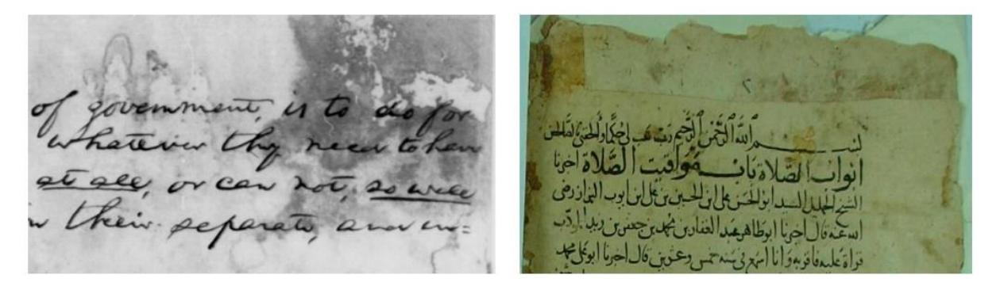

# **RESTORASI DOKUMEN TERDEGRADASI MENGGUNAKAN GENERATIVE ADVERSARIAL NETWORK DENGAN DISKRIMINATOR DUAL-MODAL DAN OPTIMASI LOSS FUNCTION BERORIENTASI HTR**

# **PROPOSAL TESIS**

Dosen Pembimbing **Ir. I Gusti Bagus Baskara Nugraha, S.T., M.T., Ph.D**

# **Oleh JATNIKO NUR MUTAQIN NIM: 23523314**

**Program Studi Magister Informatika Sekolah Teknik Elektro dan Informatika Institut Teknologi Bandung Maret 2025**

# **LEMBAR PENGESAHAN**

Proposal Tesis

# **RESTORASI DOKUMEN TERDEGRADASI MENGGUNAKAN GENERATIVE ADVERSARIAL NETWORK DENGAN DISKRIMINATOR DUAL-MODAL DAN OPTIMASI LOSS FUNCTION BERORIENTASI HTR**

# Oleh **JATNIKO NUR MUTAQIN NIM: 23523314**

Telah diperiksa dan disetujui pada tanggal 24 Maret 2025

Oleh

**Ir. I Gusti Bagus Baskara Nugraha, S.T., M.T., Ph.D**

# **DAFTAR ISI**

|        | LEMBAR PENGESAHAN                                                            |  |
|--------|------------------------------------------------------------------------------|--|
|        | DAFTAR ISI                                                                   |  |
|        | DAFTAR GAMBAR DAN ILUSTRASI DAFTAR TABEL                                  |  |
|        | <table>          DAFTAR SINGKATAN DAN LAMBANG </table>                       |  |
|        | <table>          BAB I. Pendahuluan </table>                                 |  |
| I.1    | <table>          Latar Belakang</table>                                      |  |
| $I.2$  | <table>          Rumusan Masalah         4</table>                           |  |
| I.3    | <table>          Tujuan Penelitian         6</table>                         |  |
| $I.4$  | <table>          Ruang Lingkup </table>                                      |  |
| $I.5$  | <table>          Hipotesis         8</table>                                 |  |
| I.6    | <table>          Kebaruan Penelitian</table>                                 |  |
| I.7    | <table>          Sistematika Pembahasan </table>                             |  |
| Bab II | <table>          Tinjauan Pustaka         13</table>                         |  |
| $II.1$ | <table>          Restorasi Dokumen Digital         13</table>                |  |
| II.2   | Pendekatan Restorasi Dokumen Terdegradasi                                    |  |
|        | II.2.1 Teknik Tradisional                                                    |  |
|        | II.2.2 Teknik Deep Learning                                                  |  |
| II.3   | <table>          Evaluasi Kinerja         33</table>                         |  |
|        | II.3.1 Metrik Visual                                                         |  |
|        | II.3.2 Metrik Tekstual                                                       |  |
| II.4   | <table>          Kesenjangan Penelitian         34</table>                   |  |
| II.5   | <table>    Usulan Pengembangan Framework   35</table>                        |  |
|        | <table>          Bab III. Metodologi </table>                                |  |
|        | III.1 Tahapan Design Science Research Methodology (DSRM)                     |  |
|        | <table>    III.2 Penerapan Metodologi untuk Penelitian </table>              |  |
|        | <table>          III.2.1 Identifikasi Masalah dan Motivasi</table>           |  |
|        | <table>          III.2.2 Definisi Tujuan Solusi         41</table>           |  |
|        | III.2.3 Desain dan Pengembangan Artefak ( <i>Framework</i> )                 |  |
|        | <table>          III.2.4 Demonstrasi         47 III.2.5 Evaluasi</table> |  |
|        | <table>          III.2.6 Komunikasi         51</table>                       |  |
|        | III.3 Alat dan Perangkat Lunak yang Digunakan                                |  |
|        | DAFTAR PUSTAKA                                                               |  |

# **DAFTAR GAMBAR DAN ILUSTRASI**

| Gambar II. 1 Contoh dokumen dengan degradasi pemudaran                       | 13 |
|------------------------------------------------------------------------------|----|
| Gambar II. 2 Contoh dokumen dengan degradasi bleed-through                   | 13 |
| Gambar II. 3 Contoh dokumen dengan degradasi Blur                         | 14 |
| Gambar II. 4 Contoh dokumen dengan degradasi perubahan warna              | 14 |
| Gambar II. 5 Arsitektur generator menggunakan struktur U-Net           | 19 |
| Gambar II. 6 Arsitektur diskriminator menggunakan jaringan konvolusional  | 20 |
| Gambar II. 7 Skema Alur Kerja DE-GAN                                         | 21 |
| Gambar II. 8 Pre-training pipeline pada metode TEXT-DIAE                     | 23 |
| Gambar II. 9 Proses pembuatan citra terdegradasi pada TEXT-DIAE              | 24 |
| Gambar II. 10 Pipeline fine-tuning TEXT-DIAE                                 | 26 |

# **DAFTAR TABEL**

| Tabel II.1 Kinerja teknik tradisional dalam restorasi dokumen       | 17 |
|---------------------------------------------------------------------|----|
| Tabel II. 2 Perbandingan Celah Penelitian dan Solusi yang Diusulkan | 36 |

| Tabel III. 1 Rencana Demontrasi Framework                          | 48 |
|--------------------------------------------------------------------|----|
| Tabel III. 2 Perbandingan hasil evaluasi kuantitatif dengan target | 51 |
| Tabel III. 3 Framework Deep Learning                            | 53 |
| Tabel III. 4 Manajemen Data & Augmentasi                           | 53 |
| Tabel III. 5 Infrastruktur & Hardware                           | 53 |
| Tabel III. 6 Kolaborasi & Dokumentasi                              | 53 |
| Tabel III. 7 Testing & Evaluasi                                    | 54 |

# **DAFTAR SINGKATAN DAN LAMBANG**

| SINGKATAN | NAMA                                                |
|-----------|-----------------------------------------------------|
| HTR       | Handwritten Text Recognition                        |
| GAN       | Generative Adversarial Network                      |
| PSNR      | Peak Signal-to-Noise Ratio                          |
| SSIM      | Structural Similarity Index                         |
| CER       | Character Error Rate                                |
| DE-GAN    | Document Enhancement Generative Adversarial Network |
| CNN       | Convolutional Neural Network                        |
| BiRNN     | Bidirectional Recurrent Neural Network              |
| WER       | Word Error Rate                                     |
| UU        | Undang-Undang                                       |
| FCN       | Fully Convolutional Network                         |
| DSRM      | Design Science Research Methodology                 |
| cGANs     | conditional Generative Adversarial Networks         |
| TEXT-DIAE | Text-Degradation Invariant Autoencoder              |
| OCR       | Optical Character Recognition                       |
| PCA       | Principal Component Analysis                        |
| CIE Lab   | Commission Internationale d'Eclairage               |
| ViT       | Vision Transformer                                  |
| MSA       | Multi-head Self-Attention                           |
| MLP       | Multi-Layered Perceptron                            |
| LN        | LayerNorm                                           |
| MSE       | Mean Squared Error                                  |
| IAM       | Integrated Argument Mining Tasks.                   |
| VGG19     | Visual Geometry Group                               |
| ROI       | Region of Interest                                  |
| CTC       | Connectionist Temporal Classification               |
| RGB       | Red, Green, Blue                                    |

| LAMBANG | NAMA                                              |
|---------|---------------------------------------------------|
| 𝐼       | Citra yang terdegradasi (atau memiliki watermark) |
| 𝑧       | Vektor noise acak                                 |
| 𝐼′      | Citra yang bersih                                 |
| 𝐼𝐺𝑇     | Citra ground truth                                |
| 𝐺       | Generator                                         |
| 𝜙𝐺      | Parameter generator                               |

| LAMBANG          | NAMA                                                      |  |  |  |
|------------------|-----------------------------------------------------------|--|--|--|
| 𝐷                | Diskriminator                                             |  |  |  |
| 𝜙𝐷               | Parameter diskriminator                                   |  |  |  |
| 𝔼                | Nilai ekspektasi                                          |  |  |  |
| log              | Logaritma natural                                         |  |  |  |
| (𝐼𝑊) 𝐺𝜙𝐺      | Citra yang dihasilkan oleh generator dengan parameter 𝜙𝐺  |  |  |  |
|                  | dari input 𝐼𝑊                                             |  |  |  |
| 𝐼𝑊               | Gambar yang memiliki watermark                            |  |  |  |
| 𝐿𝐺𝐴𝑁(𝜙𝐺, 𝜙𝐷)     | Fungsi loss adversarial untuk GAN                         |  |  |  |
| 𝐿𝑙𝑜𝑔(𝜙𝐺)         | Fungsi loss log untuk generator                           |  |  |  |
| 𝜆                | Hyper-parameter yang mengontrol pentingnya loss log       |  |  |  |
| min              | Minimum                                                   |  |  |  |
| max              | Maksimum                                                  |  |  |  |
| 𝐿𝑛𝑒𝑡(𝜙𝐺, 𝜙𝐷)     | Fungsi loss keseluruhan untuk jaringan DE-GAN             |  |  |  |
| 𝐼𝑑               | Gambar yang terdegradasi                                  |  |  |  |
| 𝑧𝑇               | Representasi laten yang invarian terhadap jenis degradasi |  |  |  |
| 𑇠               | 𑇠Jenis degradasi                                      |  |  |  |
| 𝐼                | Gambar asli                                               |  |  |  |
| 𝐸                | Encoder                                                   |  |  |  |
| 𝐷                | Decoder                                                   |  |  |  |
| 𝜃𝐸               | Parameter encoder                                         |  |  |  |
| 𝜃𝐷               | Parameter decoder                                         |  |  |  |
| 𝜙                | Fungsi degradasi                                          |  |  |  |
| 𝐼𝑝               | Patch gambar                                              |  |  |  |
| 𝐸𝑙𝑖𝑛             | Lapisan proyeksi linear                                   |  |  |  |
| 𝐸𝑝𝑜𝑠             | Informasi posisi 2D yang di-embed                         |  |  |  |
| 𝐿                | Jumlah blok transformer                                   |  |  |  |
| 𝑙                | Indeks lapisan transformer                                |  |  |  |
| 𝑀𝑆𝐴              | Multi-head Self-Attention                                 |  |  |  |
| 𝐿𝑁               | LayerNorm                                                 |  |  |  |
| 𝑀𝐿𝑃              | Multi-Layered Perceptron                                  |  |  |  |
| 𝐼′               | Sekumpulan vektor yang sesuai dengan patch yang           |  |  |  |
|                  | diprediksi                                                |  |  |  |
| 𝐿𝑚               | Fungsi loss Mean Squared Error untuk masking              |  |  |  |
| 𝐿𝑏               | Fungsi loss Mean Squared Error untuk blur                 |  |  |  |
| 𝐿𝑛               | Fungsi loss Mean Squared Error untuk penambahan noise     |  |  |  |
| 𝜆1, 𝜆2, 𝜆3       | Bobot untuk masing-masing fungsi loss MSE                 |  |  |  |
| 𝐿𝑝               | Loss keseluruhan untuk tahap pre-training                 |  |  |  |
| 𝐶                | Urutan karakter yang diprediksi                           |  |  |  |
| 𝑐                | Karakter dalam urutan                                     |  |  |  |
| 𝑁                | Jumlah karakter dalam urutan                              |  |  |  |
| 𝐺𝐴→𝐵 (atau 𝐺) | Generator untuk memetakan citra dari domain A ke          |  |  |  |
|                  | domain B                                                  |  |  |  |
| 𝐺𝐵→𝐴 (atau 𝐹) | Generator untuk memetakan citra dari domain B kembali     |  |  |  |
|                  | ke domain A                                               |  |  |  |
| 𝐷𝐵               | Diskriminator untuk domain B                              |  |  |  |

| LAMBANG       | NAMA                                                              |  |  |
|---------------|-------------------------------------------------------------------|--|--|
| 𝐷𝐴            | Diskriminator untuk domain A                                      |  |  |
| ℒ𝑎𝑑𝑣          | Adversarial Loss                                                  |  |  |
| 𝑝𝑑𝑎𝑡𝑎(𝑦)      | Distribusi data dari domain B                                     |  |  |
| 𝑦             | Sampel citra dari domain B                                        |  |  |
| 𝑝𝑑𝑎𝑡𝑎(𝑥)      | Distribusi data dari domain A                                     |  |  |
| 𝑥             | Sampel citra dari domain A                                        |  |  |
| 𝐺𝐴→𝐵(𝑥)       | Citra yang dihasilkan oleh 𝐺𝐴→𝐵 dari input 𝑥                   |  |  |
| 𝐷𝐵(𝑦)         | Output diskriminator 𝐷𝐵 untuk citra 𑦠                         |  |  |
| 𝐷𝐵(𝐺𝐴→𝐵(𝑥))   | Output diskriminator 𝐷𝐵 untuk citra yang dihasilkan 𝐺𝐴→𝐵(𝑥) |  |  |
| 𝐺𝐵→𝐴(𝑦)       | Citra yang dihasilkan oleh 𝐺𝐵→𝐴 dari input 𑦠                  |  |  |
| 𝐷𝐴(𝑥)         | Output diskriminator 𝐷𝐴 untuk citra 𝑥                          |  |  |
| 𝐷𝐴(𝐺𝐵→𝐴(𝑦))   | Output diskriminator 𝐷𝐴 untuk citra yang dihasilkan            |  |  |
|               | 𝐺𝐵→𝐴(𝑦)                                                           |  |  |
| ℒ𝑐𝑦𝑐𝑙𝑒        | Cycle Consistency Loss                                            |  |  |
| ∥1 ∥ ⋅  | Norma L1 (Mean Absolute Error)                                    |  |  |
| 𝐺𝐵→𝐴(𝐺𝐴→𝐵(𝑥)) | Citra 𝑥 yang ditranslasikan ke domain B dan kembali ke         |  |  |
|               | domain A                                                          |  |  |
| 𝐺𝐴→𝐵(𝐺𝐵→𝐴(𝑦)) | Citra 𑦠yang ditranslasikan ke domain A dan kembali ke         |  |  |
|               | domain B                                                          |  |  |
| ℒ𝑐𝑦𝑐𝑙𝑒_𝐴      | Forward cycle consistency loss (A → B → A)                        |  |  |
| ℒ𝑐𝑦𝑐𝑙𝑒_𝐵      | Backward cycle consistency loss (B → A → B)                       |  |  |
| 𝜆             | Bobot untuk cycle consistency loss                                |  |  |
| 𝑆             | Jaringan Similaritas pada CDSR-CycleGAN                           |  |  |
| ℒ𝑝𝑠           | Pseudo-similarity Loss                                            |  |  |
| ℒ𝑝𝑒𝑟𝑐𝑒𝑝𝑡𝑢𝑎𝑙   | Perceptual Loss                                                   |  |  |
| ℒ𝑖𝑑           | Identity Loss                                                     |  |  |
| 𝐿𝐶𝑦𝑐𝑙𝑒1       | Fungsi loss pada Siklus 1                                         |  |  |
| 𝐿1(𝑎, 𝑏)      | L1 loss yang mengukur perbedaan absolut antara piksel             |  |  |
|               | citra a dan b                                                     |  |  |
| 𝐿𝐶𝑦𝑐𝑙𝑒2       | Fungsi loss pada Siklus 2                                         |  |  |
| 𝐿𝐻𝑇𝑅          | HTR-Aware Loss                                                    |  |  |

# **BAB I. Pendahuluan**

#### **I.1 Latar Belakang**

Arsip Nasional RI menyimpan berbagai koleksi arsip bersejarah yang sangat bernilai yang diakui sebagai "Memory of th World Register" dari UNESCO, diantaranya dokumen tulisan tangan kuno dari abad ke-16 hingga ke-18, yang merepresentasikan jati diri bangsa dan merupakan aset budaya penting. Namun, dokumen-dokumen ini saat ini mengalami degradasi fisik ringan hingga berat yang disebabkan beberapa faktor antara lain lingkungan dan usia. Degradasi yang terjadi, seperti *ink bleed-through* (tembusan tinta), *fading* (pemudaran), noda, dan kerusakan struktural, tidak hanya mengganggu keutuhan visual tetapi juga mengancam keutuhan dan keaslian informasi yang terkandung di dalamnya. Hal ini menimbulkan tantangan serius dalam upaya pelestarian, sebagaimana yang diamanatkan oleh UU No. 43 Tahun 2009 tentang Kearsipan, yang menekankan pentingnya menjaga keutuhan dan keautentikan arsip sebagai sumber informasi yang akurat dan dapat diandalkan. Selain itu, degradasi fisik arsip merupakan penghambat utama dalam upaya digitalisasi dan preservasi. Secara khusus, kondisi ini menurunkan kinerja sistem *Handwritten Text Recognition* (HTR) yang krusial untuk transkripsi dokumen tulisan tangan. Akibatnya, tingkat kesalahan pengenalan karakter pada dokumen yang rusak menjadi lebih tinggi, sehingga menyulitkan proses untuk mendapatkan transkripsi akurat dan mempercepat ekstraksi informasi. Oleh karena itu, degradasi fisik menjadi tantangan signifikan bagi lembaga kearsipan.

Pendekatan untuk mengatasi masalah degradasi dokumen dapat dilakukan dengan melakukan restorasi digital, metodenya bervariasi dari mulai teknik tradisional hingga pendekatan berbasis *deep learning*. Metode tradisional seperti *thresholding* adaptif (Sauvola) dan segmentasi berbasis ruang warna (CIE Lab) telah terbukti efektif untuk kasus degradasi sederhana, seperti noda ringan atau perubahan warna minor, sebagaimana ditunjukkan oleh penelitian (Gatos dkk., 2006). Namun, metode ini sering kali kurang mampu menangani degradasi yang lebih kompleks, seperti *bleed-through* atau variasi intensitas latar belakang yang signifikan. Sebagai alternatif, metode berbasis *Generative Adversarial Networks* (GAN) menawarkan pendekatan yang menjanjikan untuk restorasi dokumen. GAN memanfaatkan dua jaringan yang saling bersaing: *generator*, yang mencoba menghasilkan citra dokumen yang lebih bersih, dan *discriminator*, yang menilai keaslian citra tersebut. Proses ini memungkinkan GAN untuk menyesuaikan diri dengan pola degradasi yang kompleks dan menghasilkan gambar yang lebih baik secara visual dalam beberapa kasus. Misalnya, studi menunjukkan bahwa GAN dapat mencapai nilai *Peak Signal-to-Noise Ratio* (PSNR) antara 33-38 dB dalam tugas pembersihan dokumen, yang lebih tinggi dibandingkan metode tradisional pada kasus tertentu. Namun, keunggulan ini tidak berlaku di semua situasi, dan PSNR saja tidak cukup untuk mengevaluasi keberhasilan restorasi. Metrik lain, sepert*i Structural Similarity Index* (SSIM) untuk kesamaan struktural atau *Character Error Rate* (CER) untuk akurasi pengenalan teks oleh sistem HTR, juga perlu dipertimbangkan untuk mendapatkan gambaran yang lebih lengkap tentang kualitas restorasi.

Metode restorasi dokumen berbasis GAN seringkali memiliki keterbatasan karena fokus utama pada peningkatan kualitas visual, seperti yang ditunjukkan oleh penelitian pada DE-GAN (Souibgui & Kessentini, 2022) dan CycleGAN (Ni dkk., 2024). Peningkatan metrik visual ini tidak selalu berkorelasi secara langsung atau proposional dengan peningkatan akurasi HTR (Jadhav dkk., 2022), yang menjadi kebutuhan utama dalam restorasi dokumen bersejarah yaitu keterbacaan informasi. Komponen GAN yang signifikan mempengaruhi metrik visual dan akurasi HTR adalah *discriminator* dan *loss fuction*, *discriminator* memastikan realisme gambar (metrik visual), sedangkan *loss function*, terutama kombinasi *adversarial* dan *recognition loss*, memastikan keseimbangan antara kualitas visual dan akurasi pengenalan teks, oleh karena itu dibutuhkan desain dan implementasi yang tepat. Untuk mengatasi hal ini, diusulkan sebuah framework GAN yang mengintegrasikan Diskriminator Dual-Modal dan Optimasi *Loss Function* Berorientasi HTR.

Diskriminator Dual-Modal dirancang untuk mengevaluasi kualitas visual dan integritas struktur teks secara simultan, yang krusial untuk keberhasilan HTR, Pendekatan ini didukung oleh penelitian sebelumnya, seperti (Arjovsky dkk., 2017; Ooi & Lim, 2023; Zhang dkk., 2024), yang menunjukkan bahwa *loss function* yang dirancang dengan baik dapat mengatasi masalah seperti *mode collapse*, *vanishing gradients* dan meningkatkan kinerja model, dan dalam penelitian lainnya (Wei dkk., 2024), yang menunjukkan bahwa penggunaan diskriminator *multi-modal* dapat secara signifikasi meningkatkan stabilitas proses pelatihan dan mempercepat konvergensi dari modul *discriminator*, hal ini sangat penting untuk menghasilkan keluaran yang berkualitas tinggi dan menghindari kegagalan model, yang merupakan masalah umum pada diskriminitor tunggal.

Kebaruan metode ini terletak pada kombinasi Diskriminator Dual-Modal dan Optimasi *Loss Function* Berorientasi HTR, yang belum ditemukan dalam penelitian sebelumnya seperti DE-GAN, CycleGAN, atau TG2 (Kodym & Hradiš, 2022). Pendekatan ini memungkinkan model untuk belajar dari dua sumber umpan balik, yaitu kualitas visual dan akurasi teks, sehingga menghasilkan restorasi yang lebih seimbang dan efektif. Dengan demikian, metode yang diusulkan tidak hanya meningkatkan kualitas visual dokumen terdegradasi, tetapi juga memastikan bahwa teks yang dihasilkan lebih akurat dikenali oleh sistem HTR, menjadikannya solusi yang lebih komprehensif untuk restorasi dokumen bersejarah.

Penelitian ini memiliki urgensi praktis dan akademis yang signifikan, terutama bagi lembaga kearsipan. Secara praktis, *framework* ini mendukung preservasi digital dokumen historis untuk menjaga keautentikan dan keutuhan informasi arsip sebagai memori kolektif bangsa. Kedua, digitalisasi dan peningkatan keterbacaan dokumen melalui HTR yang difasilitasi oleh penelitian ini akan meningkatkan aksesibilitas informasi bagi para peneliti dan masyarakat luas, yang merupakan salah satu misi utama Arsip Nasional. Ketiga, keberhasilan restorasi dokumen yang terdegradasi akan mengurangi kebutuhan transkripsi manual, menghemat biaya dan waktu operasional. Terakhir, penelitian ini berpotensi membuka jalan bagi penelitian selanjutnya yang memanfaatkan kekayaan informasi dalam arsip negara. Secara akademis, integrasi GAN dengan *discriminator* multi-modal yang fokus pada visual dan keterbacaan teks dapat memberikan kontribusi dalam pengembangan metode baru di bidang analisis dokumen. Dengan demikian, penelitian ini tidak hanya menjawab tantangan teknis yang dihadapi lembaga kearsipan tetapi juga memperkuat fondasi pelestarian warisan budaya secara global.

#### **I.2 Rumusan Masalah**

Khazanah arsip yang dimiliki oleh Institusi Kearsipan seperti Arsip Nasional atau lembaga kearsipan daerah banyak mengalami kerusakan fisik seperti *ink bleedthrough*, *fading*, noda, dan blur yang mengurangi keterbacaan teks dan menghambat proses digitalisasi. Sistem HTR saat ini memiliki akurasi rendah pada dokumen terdegradasi, sehingga diperlukan restorasi citra yang tidak hanya meningkatkan kualitas visual tetapi juga mempertahankan struktur teks untuk HTR. Berdasarkan pada hasil kajian literatur dan observasi awal, terdapat empat masalah yang ditemukan yaitu sebagai berikut:

1. Ketidakefektifan Metode Restorasi Tradisional

Metode seperti *thresholding* (Otsu, Sauvola) gagal memisahkan teks dari degradasi kompleks seperti *bleed-through* atau latar belakang tidak merata.

Contoh: Segmentasi berbasis warna atau tekstur sering keliru mengklasifikasikan noda sebagai teks.

- 2. Kurangnya Integrasi Antara Restorasi Visual dan Keterbacaan Teks Model restorasi seperti DE-GAN dapat meningkatan visual (PSNR/SSIM) tetapi beresiko mengabaikan struktur teks yang dibutuhkan untuk HTR. Contoh: Citra hasil restorasi mungkin "bersih" secara visual tetapi mengandung karakter terputus atau distorsi yang menyulitkan HTR.
- 3. Ketergantungan pada Data Pasangan dan Augmentasi Terbatas Metode berbasis GAN konvensional memerlukan data berpasangan (degradasibersih), yang sulit diperoleh untuk dokumen historis. Contoh: Pelatihan CycleGAN tanpa data pasangan menghasilkan restorasi tidak konsisten.
- 4. Kondisi degradasi yang beragam secara signifikan mengurangi performa HTR Model HTR mengalami penurunan akurasi (CER/WER) untuk kasus dokumen yang mengalami variasi degradasi.

Contoh: CER meningkat 15% pada dokumen dengan *bleed-through* berat.

## **I.2.1 Dampak dari Masalah yang Ditemukan**

- a. Efektivitas: Transkripsi dokumen historis menjadi tidak akurat, menghambat preservasi digital dan aksesibilitas arsip.
- b. Efisiensi: Proses restorasi manual atau semi-otomatis memakan waktu dan biaya tinggi.
- c. Keterbatasan Teknis: Metode saat ini kesulitan mengatasi variasi degradasi yang umum ditemui pada kondisi sesungguhnya, seperti kombinasi *bleedthrough* dan *blur*.

# **I.2.2 Logika Berpikir dalam Pembentukan Solusi**

Berdasarkan pada identifikasi masalah maka dilakukan langkah berikut untuk menyelesaikannya:

- 1. Penentuan Kebutuhan Sistem/Metode
  - a. Akurasi: Restorasi harus meningkatkan PSNR > 40 dB dan mengurangi CER/WER ≥ 25% dibandingkan dengan *baseline*.
  - b. Integrasi: Framework harus menggabungkan restorasi visual dan umpan balik HTR dengan alur kerja yang berkelanjutan
  - c. Adaptabilitas: Solusi harus mampu beradaptasi dengan berbagai jenis degradasi.
- 2. Pendekatan Teknologi
  - a. *Generative Adversarial Networks* (GAN): Dipilih untuk kebutuhan menghasilkan citra dokumen yang realistis dan adaptif.
  - b. HTR-Aware Discriminator: Integrasi model HTR ke dalam *loss function GAN* untuk menyelaraskan restorasi dengan kebutuhan pengenalan teks.
- 3. Perancangan Arsitektur Solusi
  - a. Generator: U-Net dengan input citra dokumen
  - b. Diskriminator Visual: FCN 6-lapisan untuk evaluasi kualitas citra.
  - c. Diskriminator HTR-Aware: Model HTR yang menghitung CER/WER sebagai bagian dari loss.
  - d. Alur kerja dimulai dengan tahap pra-pemrosesan, di mana data *pseudopaired* dihasilkan. Setelah itu, citra direstorasi menggunakan generator.

Selanjutnya, keterbacaan teks dievaluasi melalui HTR-aware discriminator, dan proses ini diikuti oleh umpan balik iteratif yang bertujuan mengoptimasi generator.

## 4. Rencana Pengujian dan Evaluasi

Pengujian dilakukan terhadap dataset koleksi Arsip Nasional, dengan beragam tingkat degradasi (ringan, sedang, berat), dan ditentukan matrik evaluasi dan pembanding yang sesuai dengan objek penelitian

Dari logika berpikir ini, dirumuskan pertanyaan penelitian umum dan khusus yang menjadi dasar pengembangan, yaitu: *"Bagaimana penggunaan model GAN dapat membantu memperbaiki tampilan dan keterbacaan teks pada dokumen historis yang terdegradasi?"*

Pertanyaan khusus yang akan dijawab pada penelitian ini adalah:

- a. Pertanyaan 1: Bagaimana transkripsi pada HTR memandu GAN dalam melakukan rekonstruksi citra dokumen?
- b. Pertanyaan 2: Jika model restorasi dilatih dengan mempertimbangkan bagaimana komputer membaca teks, apakah hasilnya akan lebih baik dalam memperbaiki keterbacaan teks dibandingkan metode lainnya?
- c. Pertanyaan 3: Bagaimana cara membuat model restorasi agar bisa mengatasi berbagai macam masalah kerusakan yang mungkin terjadi bersamaan pada dokumen historis?

Rumusan masalah ini difokuskan pada masalah utama dalam restorasi dokumen historis dan mengarahkan solusi ke pendekatan terintegrasi yang menggabungkan GAN, dan evaluasi berbasis HTR. Dengan menjawab pertanyaan penelitian, diharapkan tersedia framework yang tidak hanya meningkatkan kualitas visual tetapi juga mendukung preservasi digital melalui transkripsi teks yang akurat.

# **I.3 Tujuan Penelitian**

Tujuan utama penelitian ini adalah mengembangkan kerangka kerja berbasis GAN yang mengutamakan diskriminator berorientasi pada HTR untuk meningkatkan kualitas visual dokumen historis terdegradasi dan memulihkan struktur teks agar mudah dikenali oleh model HTR dan manusia. Secara khusus penelitian akan melakukan tiga tujuan spesifik yaitu:

1. Mengintegrasikan Model HTR ke dalam Loss Function GAN

Membangun diskriminator tambahan berbasis CRNN yang menggunakan CTC loss atau *sparse categorical cross-entropy* untuk menilai keterbacaan teks hasil restorasi berdasarkan pada perbandingan dengan label ground truth, lalu menggunakannya sebagai umpan balik adversarial untuk melatih generator agar menghasilkan gambar yang lebih mudah dibaca oleh model HTR

2. Evaluasi Performa pada Dataset

Menguji framework pada dokumen historis dari Arsip Nasional dan dataset publik (DIBCO), dengan metrik Visual dan HTR

# **I.4 Ruang Lingkup**

Agar penelitian ini tetap fokus dan dapat menghasilkan solusi yang efektif, maka ditentukan ruang lingkup dan pembatasan masalah sebagai berikut:

- 1. Batasan Penelitian
  - a. Fokus pada tulisan tangan pada dokumen historis, bukan dokumen cetak
  - b. Degradasi yang ditangani terbatas pada *bleed-through*, *fading*, noda, dan blur.
  - c. Evaluasi HTR menggunakan model berbasis CRNN, bukan OCR tradisional.
- 2. Aspek yang dikaji
  - a. Variabel Independen: Jenis dan tingkat degradasi, dan Transkripsi teks
  - b. Variabel Dependen: Kualitas visual restorasi (PSNR, SSIM), dan Akurasi HTR (CER, WER).
  - c. Isu Utama: Dampak kerusakan atau degradasi pada keterbacaan teks, dan Keseimbangan (*Trade-off*) antara presisi restorasi visual dan struktur teks.
- 3. Konteks dan Kondisi Lingkungan:
  - a. Pengumpulan Data: Citra dokumen diproses dalam kondisi pencahayaan terkontrol (D65 standard illuminant), dan sumber data berasal dari Arsip Nasional serta dataset sintetik dengan augmentasi degradasi realistis.

- b. Kondisi Operasional: Pengujian dilakukan pada lingkungan komputasi dengan GPU (NVIDIA RTX A4000) untuk mempercepat pelatihan GAN.
- 4. Metode dan Teknologi yang digunakan
- a. Pendekatan Metodologis

Metode ini menggunakan GAN dengan diskriminator dual cabang yang terdiri atas Generator berbasis U-Net dengan *skip connections*, Diskriminator Visual berbasis konvolusi dengan 4 lapisan downsampling (pixel-level FCN), dan Diskriminator HTR-Aware yang mengintegrasikan model CRNN (CNN + BiLSTM) untuk menilai readability teks melalui CTC loss. Selain itu, dataset menggunakan degradasi sintetik yang disiapkan sebelumnya (seperti bleed-through, blur, noda, dan fading) untuk mendukung pelatihan yang invarian terhadap berbagai jenis degradasi.

b. Teknologi/Algoritma

Pendekatan ini memanfaatkan framework machine learning seperti PyTorch, TensorFlow, dan Keras, serta arsitektur jaringan seperti U-Net, CNN, dan BiRNN. Kakas pendukung yang digunakan meliputi OpenCV untuk prapemrosesan citra serta Loghi-HTR/Transkribus untuk validasi HTR.

Ruang lingkup penelitian ini mencakup pengembangan framework GAN yang menyelaraskan restorasi visual dan akurasi HTR untuk dokumen historis terdegradasi. Cakupan meliputi:

- 1. Integrasi HTR-aware loss untuk mengoptimalkan keterbacaan teks.
- 2. Evaluasi komparatif dengan metode konvensional (DE-GAN, Otsu) dan autoencoder (Text-DIAE).
- 3. Validasi praktis melalui penerapan pada koleksi Arsip Nasional.

Dengan batasan dan ruang lingkup ini diharapkan penelitian fokus pada solusi spesifik untuk preservasi digital dokumen historis, sekaligus menyediakan dasar metodologis untuk pengembangan lebih lanjut.

# **I.5 Hipotesis**

Hipotesis dalam penelitian ini dirumuskan berdasarkan identifikasi masalah, logika berpikir dalam pembentukan solusi, serta hasil penelitian terdahulu. Pengujian hipotesis akan dilakukan melalui pengembangan framework restorasi berbasis GAN dengan diskriminator HTR-aware dan evaluasi kinerjanya dalam meningkatkan kualitas visual serta akurasi pengenalan teks pada dokumen historis. Berikut ini hipotesis yang diusulkan pada penelitian ini:

Hipotesis Nol (H₀): Penggunaan framework GAN dengan diskriminator HTRaware tidak secara signifikan meningkatkan kualitas visual restorasi (PSNR, SSIM) dan akurasi pengenalan teks (CER, WER) dibandingkan dengan metode restorasi konvensional atau model *autoencoder*.

Hipotesis Alternatif (H₁): Framework GAN dengan diskriminator HTR-aware menghasilkan peningkatan signifikan dengan kualitas visual yang lebih baik (PSNR ≥ 40 dB, SSIM ≥ 0.90) dan penurunan CER minimal 25% dibandingkan dengan metode pembanding.

1. Rencana Pengujian

Untuk menguji hipotesis tersebut, penelitian akan melibatkan pengumpulan data uji yang mencakup 500 citra dokumen tulisan tangan terdegradasi dari Arsip Nasional, yang dilengkapi dengan ground truth, serta 1.000 citra sintetik dengan augmentasi degradasi, seperti *ink bleed-through*, *fading*, noda dan blur. Selain itu, dataset publik seperti DIBCO 2017 dan Bentham Papers juga akan digunakan untuk menguji generalisasi metode yang dikembangkan.

2. Metode Pembading

Metode pembanding dalam penelitian ini meliputi DE-GAN tanpa penerapan HTR-aware loss, metode binarisasi adaptif seperti Otsu dan Sauvola, serta model autoencoder berbasis transformer yaitu Text-DIAE.

3. Evaluasi Performa

Evaluasi performa akan dilakukan dengan mengukur parameter visual seperti PSNR, SSIM, dan DRD, serta parameter pengenalan teks seperti CER, WER, dan Document-Level Accuracy.

4. Analisis Statistik

Analisis statistik dalam penelitian ini akan mencakup uji-T berpasangan untuk membandingkan perbedaan CER dan WER antara framework yang diusulkan dan metode pembanding. Selain itu, ANOVA akan digunakan untuk mengukur signifikansi peningkatan PSNR dan SSIM pada berbagai tingkat degradasi, didukung oleh perhitungan Confidence Interval sebesar 95% untuk menilai keandalan perbedaan akurasi.

5. Harapan dan Implikasi

Diharapkan penelitian ini dapat memberikan bukti empiris bahwa integrasi HTR-aware loss dalam framework GAN meningkatkan keterbacaan teks tanpa mengorbankan kualitas visual, selain itu pendekatan integratif yang dikembangkan diharapkan menyediakan protokol restorasi dokumen historis yang lebih efektif, mendukung upaya digitalisasi arsip nasional, serta berkontribusi pada pelestarian warisan budaya.

# **I.6 Kebaruan Penelitian**

Kebaruan penelitian ini yaitu, berupaya berkontribusi pada bidang restorasi dokumen historis terdegradasi melalui dua inovasi utama:

- 1. Integrasi fungsi loss HTR ke dalam GAN, memungkinkan pelatihan model yang mempertimbangkan keterbacaan teks, dan
- 2. Pengembangan *pseudo-paired* data untuk mengatasi keterbatasan data berpasangan.

Berikut ini diberikan tabel perbandingan antara kebaruan pada penelitan ini dengan *state-of-the-art*:

| Aspek            | Penelitian Ini                                    | SOTA                |                      |                    |  |
|------------------|---------------------------------------------------|---------------------|----------------------|--------------------|--|
|                  |                                                   | DE-GAN              | Text-DIAE            | Tradisional        |  |
| Integrasi HTR | HTR-aware discriminator                           | Hanya visual        | Autoencoder + HTR | Tidak relevan      |  |
| Data Sintetik | Data berpasangan dengan cycle-consistency loss | Data berpasangan | Data berpasangan  | Tidak digunakan |  |

| Tabel I. 1 | Perbandingan Kebaruan |  | Penelitian | dengan SOTA |  |
|------------|-----------------------|--|------------|-------------|--|
|------------|-----------------------|--|------------|-------------|--|

Penerapan framework ini berpotensi untuk mendukung pelestarian dokumen historis. Berdasarkan hasil eksperimen awal, framework ini tidak hanya berupaya membersihkan dokumen, tetapi juga dirancang untuk menghasilkan hasil restorasi yang lebih kompatibel dengan sistem HTR, yang selanjutnya akan digunakan untuk membantu mempercepat proses digitalisasi arsip serta berkontribusi terhadap efisiensi biaya dan waktu. Selain itu, penggunaan augmentasi data sintetik dalam penelitian ini diharapkan dapat mengurangi ketergantungan pada pengumpulan data berpasangan yang berbiaya tinggi, dan integrasi dengan sistem HTR telah dioptimalkan untuk mengurangi kebutuhan intervensi manual di tahap akhir.

# **I.7 Sistematika Pembahasan**

Untuk menyajikan penelitian ini secara terstruktur dan memudahkan pemahaman, tesis ini dibagi menjadi beberapa bab dengan susunan sebagai berikut:

# Bab I Pendahuluan

Bab ini membahas latar belakang pentingnya restorasi dokumen historis dan keterbatasan metode konvensional seperti segmentasi berbasis *thresholding*. Di dalamnya dijelaskan urgensi integrasi teknologi HTR untuk meningkatkan kualitas visual dan akurasi pembacaan teks. Rumusan masalah, tujuan penelitian, hipotesis, serta kebaruan penelitian, yaitu pengembangan framework GAN dengan HTRaware discriminator dan *pseudo-paired data* berbasis CycleGAN juga diuraikan secara ringkas.

# Bab II Tinjauan Pustaka

Bab ini mengkaji literatur yang menjadi dasar teori dalam penelitian, mencakup teori arsitektur GAN (seperti U-Net, CycleGAN), dan model HTR (CNN - RNN). Selain itu, penelitian terdahulu seperti DE-GAN, Text-DIAE dikaji untuk mengidentifikasi celah penelitian, yaitu belum tersedianya framework yang menyelaraskan restorasi visual dengan optimasi keterbacaan teks.

# Bab III Metodologi Penelitian

Bab ini menguraikan pendekatan penelitian yang mengintegrasikan *Design Science Research Methodology* (DSRM) untuk kerangka sistematis (identifikasi masalah, penetapan tujuan, desain, evaluasi) dengan iterasi *deep learning* untuk implementasi teknis framework GAN. Metodologi penelitian meliputi: analisis masalah dan literatur, penetapan target optimasi, perancangan dan pengembangan model (U-Net generator, diskriminator dual-branch dengan FCN dan Vision Transformer) melalui pelatihan iteratif, evaluasi menggunakan metrik kuantitatif dan analisis statistik, serta publikasi hasil dan sumber daya untuk reproduktifitas.

Bab IV Analisis & Desain

Bab ini menguraikan analisis kebutuhan sistem yang mencakup: Kebutuhan Fungsional: Restorasi bleed-through, dan kompatibilitas dengan HTR, dan Kebutuhan Non-fungsional: Standar performa seperti PSNR > 40 dB dan waktu inferensi kurang dari 15 detik per citra. Selain itu dijelaskan desain arsitektur sistem yang meliputi penggunaan generator U-Net dan diskriminator HTR-aware, proses augmentasi sintetik, alur pemrosesan data dari pra-pemrosesan hingga evaluasi HTR, serta desain database untuk penyimpanan hasil restorasi dan transkripsi teks.

#### Bab V Kesimpulan & Saran

Bab ini menyajikan rangkuman temuan utama dari penelitian, menilai keefektifan framework GAN dengan HTR-aware discriminator dalam meningkatkan kualitas restorasi dokumen historis dan akurasi HTR. Disampaikan pula saran untuk pengembangan lebih lanjut, termasuk peningkatan metode augmentasi data dan optimasi model, serta implikasi praktis untuk aplikasi restorasi dokumen.

# **Bab II Tinjauan Pustaka**

# **II.1 Restorasi Dokumen Digital**

Restorasi Dokumen Digital adalah proses penggunaan teknik digital untuk memulihkan dan meningkatkan kualitas visual dokumen yang telah didigitalkan, terutama ketika dokumen tersebut mengalami degradasi. Proses ini bertujuan untuk mengembalikan tampilan dokumen sedekat mungkin dengan kondisi fisik aslinya ketika pertama kali dibuat (Bianco dkk., 2010)

Fokus utama dari restorasi dokumen terdegradasi adalah pada dokumen sejarah yang ditulis tangan dan telah didigitalkan. Dokumen-dokumen ini memiliki nilai budaya dan historis yang tinggi sehingga pelestariannya sangat penting. Dokumen sejarah sering kali mengalami berbagai jenis kerusakan, antara lain:

1. Pemudaran (*Fading)*: Warna tinta atau pigmen memudar seiring waktu, sehingga teks menjadi sulit dibaca (Perino dkk., 2024).

**Gambar II. 1** Contoh dokumen dengan degradasi pemudaran (DIBCO, ANRI)

2. Tembusan Tinta *(Bleed-through)*: Tinta dari sisi belakang halaman merembes ke sisi depan, mengganggu keterbacaan teks (Hanif dkk., 2018)

**Gambar II. 2** Contoh dokumen degradasi *bleed-through* (DIBCO, ANRI)

3. Kabur (*Blur*): Kondisi di mana ketajaman teks atau elemen visual lainnya pada dokumen menjadi kabur atau tidak fokus, sehingga sulit dibaca atau dianalisis (Sulaiman dkk., 2019)

**Gambar II. 3** Contoh dokumen dengan degradasi *Blur* (DIBCO)

3. Perubahan Warna *(Discoloration)*: Terpapar cahaya, kelembapan, dan polutan dapat menyebabkan perubahan warna pada kertas dan tinta (Bianco et al., 2010; Yiping et al., 2021).

**Gambar II. 4** Contoh dokumen dengan degradasi perubahan warna (DIBCO)

4. Kerusakan fisik: Robekan, lubang, atau kerusakan fisik lainnya yang dapat mengaburkan teks (Lechuga-S. et al., 2014; Valdiviezo-N et al., 2017).

Restorasi dokumen terdegradasi memberikan beberapa manfaat penting, antara lain:

a. Peningkatan Keterbacaan Teks: Proses restorasi membantu teks menjadi lebih jelas, sehingga memudahkan pembaca manusia serta sistem *HTR* dalam mengenali dan menyalin teks (Bianco et al., 2010; Suvaris & Sathyanarayana, 2023; Debole et al., 2018).

- b. Pelestarian Dokumen: Dengan memperbaiki tampilan digital dokumen, nilai sejarah dan budaya dokumen tersebut dapat dipertahankan untuk generasi mendatang (Bianco et al., 2010; Suvaris & Sathyanarayana, 2023).
- c. Aksesibilitas: Dokumen yang telah direstorasi dapat dengan mudah diakses oleh peneliti, sejarawan, dan masyarakat umum, sehingga meningkatkan penyebaran pengetahuan sejarah (Bianco et al., 2010; Debole et al., 2018).

# **II.1.2 Terminologi Kunci**

Dalam konteks *framework* dengan Diskriminator HTR-Aware untuk dokumen terdegradasi terdapat tiga istilah kunci yang saling mendukung dalam proses restorasi dokumen terdegradasi:

- a. *Fidelitas Visual*: Merujuk pada kesesuaian citra hasil restorasi dengan dokumen asli dalam hal struktur dan tekstur. Konsep ini menekankan bahwa tampilan visual hasil restorasi harus mendekati kondisi fisik asli dokumen, sehingga setiap elemen struktural dan detail tekstural dapat dipertahankan (Souibgui et al., 2022).
- b. *Fidelitas Tekstual*: Mengacu pada akurasi teks yang dihasilkan oleh sistem *OCR/HTR* setelah proses restorasi. Dengan kata lain, teks yang terbaca harus sesuai dengan isi asli dokumen, sehingga memudahkan proses pengenalan karakter dan pemrosesan lebih lanjut (Souibgui & Kessentini, 2020).
- c. *HTR-Aware Discriminator*: Merupakan komponen dalam arsitektur GAN yang secara khusus mengevaluasi kualitas citra berdasarkan keterbacaan teks oleh mesin *OCR/HTR*. Komponen ini mengintegrasikan fungsi loss khusus yang mengutamakan peningkatan akurasi teks, sehingga hasil restorasi tidak hanya terlihat realistis secara visual tetapi juga optimal dari segi pengenalan teks (Souibgui et al., 2022; Souibgui & Kessentini, 2020).

## **II.2 Pendekatan Restorasi Dokumen Terdegradasi**

Dokumen terdegradasi dapat direstorasi dengan dua pendekatan utama, yaitu teknik tradisional dan teknik deep learning. Pendekatan tradisional, seperti penggunaan PCA dan *clustering*, telah diterapkan untuk mengatasi gangguan seperti bleedthrough, meskipun sering kali terbatas dalam generalisasi dan memerlukan banyak langkah *pre- processing* serta *post-processing* (Drira & Emptoz, 2005; Drira, 2006). Sebaliknya, pendekatan *deep learning* menggunakan model *neural network* dan teknik *inpainting* untuk meningkatkan keterbacaan serta efisiensi restorasi, terutama pada dokumen dengan degradasi yang parah (Mao et al., 2025; Wadhwani et al., 2020). Berikut ini penjelasan kedua teknik tersebut:

## **II.2.1 Teknik Tradisional**

Pendekatan berbasis visi komputer telah lama menjadi landasan dalam restorasi dokumen terdegradasi, terutama sebelum munculnya metode deep learning yang lebih kompleks. Secara tradisional, metode restorasi mengandalkan teknik-teknik pemrosesan citra klasik untuk mengatasi berbagai masalah yang timbul akibat penurunan kualitas dokumen seiring waktu. Salah satu pendekatan klasik yang dilakukan adalah Binarisasi.

1. Binarisasi Dokumen

Binarisasi dokumen adalah langkah kritis dalam pemrosesan citra, terutama untuk dokumen historis yang sering mengalami degradasi seperti ink *bleed-through*, noda, atau iluminasi tidak merata. Tujuan utamanya adalah memisahkan teks (*foreground*) dari latar belakang (*background*) untuk memfasilitasi analisis lebih lanjut, seperti HTR. Teknik klasik seperti *thresholding global* (Otsu) dan lokal (Niblack, Sauvola) awalnya diandalkan karena efisiensi komputasionalnya, tetapi memiliki keterbatasan pada dokumen dengan degradasi kompleks.

b. Otsu (*Thresholding Global*)

Metode ini menghitung ambang batas optimal berdasarkan varians antar-kelas untuk seluruh gambar, cocok untuk histogram bimodal. Namun, pada dokumen dengan latar belakang tidak seragam, seperti ink *bleed-through*, Otsu sering gagal karena asumsinya tentang distribusi intensitas tidak terpenuhi. Penelitian menunjukkan performanya menurun pada gambar dengan variasi iluminasi tinggi, seperti yang terlihat pada dataset DIBCO (Sulaiman dkk., 2019).

c. Niblack dan Sauvola (*Thresholding Lokal*)

Metode ini menggunakan jendela geser untuk menghitung ambang batas berdasarkan mean dan deviasi standar lokal, lebih adaptif untuk latar belakang tidak seragam. Niblack sering menghasilkan *noise* latar belakang, sedangkan Sauvola, meskipun perbaikan dari Niblack, masih menghasilkan teks pecah pada dokumen dengan kontras rendah atau *ink bleed-through*. Evaluasi pada dataset H-DIBCO2016 menunjukkan Niblack (F-Measure 63.10, PSNR 12.47, DRD 31.48) dan Sauvola (F-Measure 81.27, PSNR 15.36, DRD 17.92) kurang optimal dibandingkan Otsu (F-Measure 86.59, PSNR 17.79, DRD 6.89), tetapi ini tidak mencerminkan performa pada kasus ekstrem (Yang dkk., 2024).

2. Kegagalan Teknik Tradisional pada Degradasi Kompleks

*Ink bleed-through* terjadi ketika tinta dari sisi belakang kertas tembus ke sisi depan, menciptakan artefak yang sulit dibedakan dari teks asli. Variasi intensitas latar belakang tinggi, seperti noda atau iluminasi tidak merata, juga mengganggu pemisahan teks. Penelitian menunjukkan:

- a. Otsu gagal karena ambang batas globalnya tidak dapat menangani variasi lokal, terutama pada dokumen dengan ink bleed-through, seperti yang diilustrasikan pada contoh dataset DIBCO (Lu dkk., 2018).
- b. Niblack sering menghasilkan noise latar belakang, terutama pada area dengan ink bleed-through, seperti yang dibahas dalam perbandingan metode pada dokumen kuno (Khurshid dkk., 2009).
- c. Sauvola, meskipun lebih baik dari Niblack, masih menghasilkan teks pecah atau hilang pada dokumen dengan kontras rendah, seperti yang terlihat pada evaluasi pada dataset DIBCO (Xiong dkk., 2021).
- 3. Evaluasi Kuantitatif

Tabel berikut merangkum performa metode pada dataset H-DIBCO2016, yang mencakup berbagai degradasi termasuk ink *bleed-through*:

| Metode  | F-Measure | PSNR  | DRD   |
|---------|-----------|-------|-------|
| Otsu    | 86.59     | 17.79 | 6.89  |
| Niblack | 63.10     | 12.47 | 31.48 |
| Sauvola | 81.27     | 15.36 | 17.92 |

**Tabel II.1** Kinerja teknik tradisional dalam restorasi dokumen

Meskipun Otsu menunjukkan performa lebih baik secara keseluruhan, analisis lebih lanjut menunjukkan kegagalan pada gambar tertentu dengan *ink bleed-through*, seperti yang dijelaskan oleh (Yang dkk., 2024) yang membandingkan metode tradisional dengan pendekatan berbasis *deep learning*.

#### **II.2.2 Teknik Deep Learning**

Deep learning telah membawa revolusi signifikan dalam restorasi dokumen digital, terutama melalui kemampuan untuk mempelajari dan merekonstruksi fitur-fitur kompleks dari citra terdegradasi. *Deep learning* memainkan peran sentral melalui pendekatan berbasis CNN dan GAN. Berikut adalah penjelasan masing-masing pendekatan dalam restorasi dokumen digital:

#### 1. CNN (U-Net)

CNN (U-Net*)* untuk ekstraksi fitur hierarkis pada dokumen terdegradasi: CNN dengan arsitektur U-Net berperan penting dalam mengekstraksi fitur hierarkis dari dokumen terdegradasi. Dengan struktur *encoder-decoder* yang dilengkapi dengan skip connections, U-Net mampu menangkap informasi dari level lokal hingga global. Pendekatan ini memungkinkan pemrosesan detail-detail penting, seperti kontur dan tekstur teks, sehingga membantu dalam mengidentifikasi serta mengoreksi kerusakan pada dokumen (Ronneberger, Fischer, & Brox, 2015; Souibgui & Kessentini, 2022).

## 2. GAN (DE-GAN)

DE-GAN (*Document Enhancement Generative Adversarial Network*) adalah sebuah kerangka kerja *end-to-end* yang efektif yang menggunakan *conditional Generative Adversarial Networks* (cGANs) untuk memulihkan gambar dokumen yang terdegradasi.

a. Tujuan Utama

Tujuan utama DE-GAN adalah untuk menghasilkan versi yang ditingkatkan dari dokumen yang terdegradasi dengan kualitas tinggi. Ini mencakup berbagai masalah peningkatan dokumen seperti pembersihan dokumen, binarisasi, penghilangan *blurring* (*deblurring*), dan penghilangan *watermark*. Metode ini juga memperkenalkan masalah baru dalam peningkatan dokumen, yaitu penghilangan *watermark* dan stempel yang padat.

b. Pendekatan Berbasis cGANs

DE-GAN menggunakan cGANs karena peningkatan dokumen dapat dilihat sebagai tugas terjemahan gambar-ke-gambar (*image-to-image translation*). Dalam proses ini, teks perlu dipertahankan sementara kerusakan harus

dihilangkan dari gambar yang dikondisikan. cGANs, yang merupakan variasi dari GANs, mempelajari model generatif bersyarat, di mana model ini dikondisikan pada gambar input dan menghasilkan gambar output yang sesuai.

c. Arsitektur DE-GAN

DE-GAN terdiri dari dua jaringan saraf: Generator (G) bertugas mempelajari pemetaan dari gambar yang terdegradasi (atau memiliki *watermark*) yang dilambangkan sebagai , dan vektor *noise* acak , ke gambar yang bersih yang diharapkan mendekati gambar *ground truth* . Arsitektur generator yang digunakan dalam DE-GAN mengikuti struktur U-net. Model U-net umumnya digunakan untuk tugas terjemahan gambar-ke-gambar dan terdiri dari lapisanlapisan konvolusi yang melakukan *down-sampling* (*encoder*) diikuti oleh lapisan-lapisan *up-sampling* dan konvolusi (*decoder*). *Skip connections* ditambahkan setiap dua lapisan untuk memulihkan informasi yang hilang selama *down-sampling* dan mencegah masalah gradien menghilang dan membengkak dalam model yang sangat dalam.

# **Gambar II. 5** Arsitektur *generator* menggunakan struktur U-Net (Souibgui & Kessentini, 2022)

Diskriminator (D): Diskriminator bertugas membedakan antara gambar bersih yang sebenarnya () dan gambar yang dihasilkan oleh generator (()). Input ke diskriminator adalah gabungan dari gambar yang terdegradasi () dan gambar bersih (baik atau ()). Diskriminator yang digunakan dalam DE-GAN adalah *Fully Convolutional Network* (FCN) sederhana yang terdiri dari beberapa lapisan konvolusi dan menghasilkan matriks 2D yang berisi probabilitas bahwa gambar yang dimasukkan adalah nyata (gambar *ground truth*).

**Gambar II. 6** Arsitektur diskriminator menggunakan jaringan konvolusional (Souibgui & Kessentini, 2022)

## d. Fungsi Loss

Pelatihan cGANs dalam DE-GAN dilakukan dengan fungsi *loss* adversarial berikut:

$$L_{GAN}(\phi_G, \phi_D) = \mathbb{E}_{I_W, I_{GT}}[\log D_{\phi_D}(I_W, I_{GT})] + \mathbb{E}_{I_W}[\log (1 - D_{\phi_D}(I_W, G_{\phi_G}(I_W)))]$$
(II. 1)

Di mana dan adalah parameter generator dan diskriminator, masing-masing. Fungsi ini mendorong generator untuk menghasilkan gambar yang cukup mirip dengan *ground truth* sehingga dapat menipu diskriminator.

Selain itu, untuk memastikan teks dalam dokumen dipertahankan dengan baik, DE-GAN menggunakan fungsi *loss* log tambahan antara gambar yang dihasilkan dan *ground truth*:

$$L_{log}(\phi_G) = \mathbb{E}_{I_{GT},I_W} \left[ -\left( I_{GT} \log \left( G_{\phi_G}(I_W) \right) + \left( (1 - I_{GT}) \log \left( 1 - G_{\phi_G}(I_W) \right) \right) \right) \right]$$
 (II. 2)

Fungsi *loss* keseluruhan untuk jaringan DE-GAN adalah kombinasi dari kedua fungsi *loss*ini: (,) = minmax (,) + ( ) Di mana adalah *hyper-parameter* yang mengontrol pentingnya *loss* log. Nilai yang berbeda digunakan untuk tugas yang berbeda (pembersihan teks, penghilangan *watermark*, dan binarisasi dokumen).

#### e. Proses Pelatihan

Selama pelatihan, *patch*-*patch* gambar berukuran 256x256 piksel diambil dari gambar yang terdegradasi dan diberikan sebagai input ke generator. Gambar yang dihasilkan kemudian dimasukkan ke diskriminator bersama dengan *patch ground truth* dan *patch* gambar yang terdegradasi. Diskriminator kemudian memaksa generator untuk menghasilkan output yang tidak dapat dibedakan dari gambar "nyata" (*ground truth*), sementara diskriminator berusaha sebaik mungkin untuk mendeteksi "gambar palsu" yang dihasilkan oleh generator. Pelatihan ini dilakukan menggunakan *optimizer* Adam dengan *learning rate* 1e-4. Setelah pelatihan selesai, diskriminator tidak lagi digunakan, dan hanya jaringan generator yang digunakan untuk meningkatkan kualitas gambar dokumen yang terdegradasi.

**Gambar II. 7** Skema Alur Kerja DE-GAN (Souibgui & Kessentini, 2022)

Secara keseluruhan, teori dasar DE-GAN terletak pada pemanfaatan kekuatan cGANs untuk mempelajari pemetaan kompleks dari dokumen terdegradasi ke versi bersihnya melalui persaingan antara generator yang mencoba menghasilkan gambar realistis dan diskriminator yang mencoba membedakan antara gambar asli dan gambar yang dihasilkan. Penambahan loss log membantu memastikan bahwa konten teks penting dalam dokumen dipertahankan selama proses peningkatan. Arsitektur U-net pada generator memungkinkan model untuk menangkap fitur konteks dan detail halus yang penting untuk menghasilkan gambar yang ditingkatkan dengan kualitas tinggi.

# f. Kekurangan DE-GAN

Berikut ini merupakan kekurangan atau keterbatasan dari metode DE-GAN, terutama untuk kasus restorasi dokumen historis dengan tulisan tangan dan keterbacaan teks untuk HTR, meskipun DE-GAN menunjukkan kinerja yang unggul dalam berbagai tugas peningkatan kualitas dokumen, termasuk binarisasi dokumen historis, terdapat beberapa kasus di mana hasilnya belum sepenuhnya memuaskan.

- 1. Pada tugas binarisasi dokumen yang sangat padat degradasi (*highly dense*), DE-GAN mungkin mengalami kesulitan untuk memulihkan teks secara sempurna. Hal ini bisa menjadi masalah yang lebih signifikan pada dokumen historis yang seringkali mengalami degradasi berat dan tidak merata.
- 2. Pada tugas binarisasi dokumen historis dengan noda dan *show-through*, terlihat bahwa beberapa bagian tidak pulih dengan baik. Ini menunjukkan bahwa untuk degradasi yang sangat kompleks atau intens, DE-GAN mungkin masih menghasilkan artefak atau kehilangan informasi teks.

Dalam perbandingan dengan metode *state-of-the-art* pada dataset H-DIBCO 2018 (yang berfokus pada dokumen tulisan tangan historis), DE-GAN meraih posisi kedua terbaik dalam metrik DRD, PSNR, F-measure, dan pseudo F-Measure. Meskipun ini menunjukkan kinerja yang sangat baik, fakta bahwa ada metode lain yang sedikit lebih unggul (yang menggunakan banyak langkah pra-pemrosesan dan pasca-pemrosesan khusus untuk dataset tersebut) mengindikasikan bahwa DE-GAN mungkin tidak selalu menjadi solusi terbaik untuk setiap jenis degradasi pada dokumen tulisan tangan historis tanpa penyesuaian lebih lanjut. DE-GAN dipresentasikan sebagai model *end-to-end* sederhana tanpa langkah pemrosesan tambahan.

Secara keseluruhan, meskipun DE-GAN adalah metode yang menjanjikan untuk restorasi berbagai jenis dokumen histori terdegradasi, penelitian menunjukkan bahwa degradasi yang sangat parah, tidak merata, atau memiliki karakteristik kompleks (seperti pada beberapa dokumen tulisan tangan historis) masih menjadi tantangan.

# 3. TEXT-DIAE (Text-Degradation Invariant Autoencoder)

TEXT-DIAE adalah sebuah model *self-supervised* yang dirancang untuk menangani dua tugas utama: pengenalan teks (baik tulisan tangan maupun teks pada gambar) dan peningkatan kualitas gambar dokumen. Model ini bertujuan untuk mempelajari representasi fitur yang invarian terhadap degradasi melalui tahap *pretraining* tanpa menggunakan data berlabel, yang kemudian dapat di-*fine-tune* untuk tugas-tugas spesifik dengan data berlabel.

# 1. Arsitektur Dasar

TEXT-DIAE mengadopsi arsitektur berbasis transformer. Arsitektur ini terdiri dari dua langkah utama: tahap *pre-training* untuk mempelajari representasi fitur yang berguna dari data tidak berlabel, dan tahap *fine-tuning* yang diawasi untuk tugas hilir yang diinginkan. Secara umum, model ini memiliki komponen encoder () dan decoder () dengan parameter yang dapat dipelajari (, ).

# 2. Tahap *Pre-training*

Tujuan utama dari tahap *pre-training* adalah untuk melatih encoder () agar dapat memetakan gambar yang terdegradasi () ke dalam representasi laten () yang kaya dan invarian terhadap jenis degradasi () yang diterapkan. Kemudian, decoder () dilatih untuk merekonstruksi gambar asli () dari representasi laten ini. Proses *pre-training* diilustrasikan pada gambar II.8

**Gambar II. 8** Pre-training pipeline pada metode TEXT-DIAE (Souibgui dkk., 2022)

## 3. Degradasi Input

Untuk setiap gambar tidak berlabel (*I*), diterapkan fungsi degradasi  $\phi$  yang menghasilkan versi terdegradasi  $I_d = \phi(I, T)$ , di mana T adalah jenis degradasi yang dipilih dari {mask, blur, noise}. Gambar II.9 secara visual menggambarkan proses ini.

**Gambar II. 9** Proses pembuatan citra terdegradasi pada TEXT-DIAE (Souibgui dkk., 2022)

a. Encoder: Arsitektur encoder  $(E)$  menggunakan *backbone Vision Transformer* (ViT). Gambar input  $I_d$  pertama-tama dibagi menjadi sekumpulan N patch  $(I_p^d = \{I_{p1}^d, I_{p2}^d, \dots, I_{pN}^d\})$ . Setiap *patch* kemudian di-*embed* menggunakan lapisan proyeksi linear yang dapat dilatih ( $E_{lin}$ ). TEXT-DIAE menggunakan lapisan proyeksi linear yang berbeda untuk setiap tugas *pre-text*. Token-token ini kemudian digabungkan dengan informasi posisi 2D yang di-*embed* ( $E_{pos}$ ) dan diumpankan ke L blok transformer untuk menghasilkan representasi laten  $z_T$ . Setiap blok transformer terdiri dari lapisan *Multi-head Self-Attention* (MSA) dan feedforward Multi-Layered Perceptron (MLP), yang didahului oleh LayerNorm (LN) dan diikuti oleh koneksi residual. Proses encoder secara matematis dapat dirumuskan sebagai:

$$z0=ElinIpd+Epos$$
  

$$zl'=MSALNzl-1+zl-1, l=1,...,L$$
  

$$zl=MLPLNzl'+zl', l=1,...,L$$
  

$$zT=LNzL$$
  
(II. 3)

b. Decoder: Decoder  $(D)$  juga terdiri dari blok-blok transformer dengan struktur dan jumlah lapisan yang sama dengan encoder. Input decoder adalah output dari encoder (). Output decoder adalah sekumpulan vektor = {1 ,2 , . . . , }, di mana setiap vektor sesuai dengan *patch* yang diprediksi (direkonstruksi). Sama seperti encoder, lapisan linear yang berbeda digunakan untuk setiap tugas *pre-text*. Proses decoder secara matematis dapat dirumuskan sebagai:

$$z'_{l} = MSA(LN(z_{l-1})) + z_{l-1}, \quad l = 1,...,L$$
  

$$z_{l} = MLP(LN(z'_{l})) + z'_{l}, \quad l = 1,...,L$$
  

$$I_{r} = Linear(z_{L})$$
  
(II. 4)

d. Tugas *Pre-text* dan Fungsi *Loss*: TEXT-DIAE menggunakan tiga tugas *pre-text* utama: (1) Masking: Secara acak menutupi sebagian *patch* gambar dan melatih model untuk memprediksi *patch* yang hilang. (2) Blur: Menerapkan *blur* pada gambar dan melatih model untuk menghasilkan gambar yang tajam. (3) Penambahan Noise: Menambahkan *noise* ke gambar dan melatih model untuk membersihkan *noise* tersebut.

Untuk setiap tugas *pre-text*, digunakan fungsi *loss* Mean Squared Error (MSE) (, , ) antara gambar yang direkonstruksi ( ) dan gambar *ground truth* (). *Loss* keseluruhan untuk tahap *pre-training* adalah kombinasi weighted dari ketiga *loss* ini:

$$L_{pt} = \lambda_1 L_m(I_r, I_{gt}) + \lambda_2 L_b(I_r, I_{gt}) + \lambda_3 L_n(I_r, I_{gt})$$
 (II. 5)

Dalam eksperimen, hasil terbaik diperoleh dengan 1 = 2 = 3 = 1.

e. Keuntungan pre-training TEXT-DIAE meliputi beberapa aspek. Pendekatan ini tidak mendefinisikan urutan pada level fitur, sehingga memanfaatkan mekanisme *self-attention* dari transformer. Selain itu, metode ini tidak memerlukan batch negatif yang besar seperti pada pendekatan berbasis *contrastive learning*. Akhirnya, pre-training TEXT-DIAE menghasilkan konvergensi yang lebih cepat dibandingkan metode sebelumnya, karena hanya membutuhkan data pre-training yang jauh lebih sedikit untuk mencapai representasi yang kuat.

#### 4. Tahap *Fine-tuning*

Setelah *pre-training*, encoder dengan bobot yang telah dipelajari () digunakan sebagai inisialisasi untuk tugas-tugas hilir. Decoder yang berbeda digunakan untuk setiap tugas. Gambar 10 mengilustrasikan pipeline *fine-tuning*.

**Gambar II. 10** Pipeline fine-tuning TEXT-DIAE

- a. Pengenalan Teks (HTR dan STR): Encoder yang telah di-*pre-train* digunakan untuk mengekstrak fitur dari gambar teks yang dipotong (). Fitur ini kemudian diumpankan ke decoder transformer sekuensial ( ′ ) yang diinisialisasi secara acak untuk memprediksi urutan karakter = { 1 , 2 , . . . , } yang sesuai dengan label *ground truth* = { 1 , 2 , . . . , }. Fungsi *loss* yang digunakan selama *fine-tuning* adalah cross-entropy antara urutan karakter yang diprediksi dan *ground truth*.
- b. Peningkatan Kualitas Gambar Dokumen: Encoder yang telah di-*pre-train* digunakan untuk memproses gambar dokumen yang terdegradasi () untuk mendapatkan representasi laten (). Kemudian, decoder ( ′′) digunakan untuk menghasilkan gambar yang bersih ( ) dari representasi ini. Fungsi *loss* yang digunakan selama *fine-tuning* adalah Mean Squared Error (MSE) antara gambar yang dibersihkan ( ) dan gambar bersih *ground truth* ().

Secara keseluruhan, TEXT-DIAE menawarkan pendekatan *self-supervised* yang efektif untuk mempelajari representasi visual yang kuat dan invarian terhadap degradasi, yang terbukti sangat berguna untuk berbagai tugas pemrosesan dokumen. Penggunaan arsitektur transformer dan tugas-tugas *pre-text* yang dirancang khusus memungkinkan model ini untuk mencapai kinerja yang unggul dengan kebutuhan data yang lebih rendah.

## 5. Kekurangan TEXT-DIAE

Meskipun TEXT-DIAE menunjukkan kemajuan signifikan dalam restorasi dokumen dan HTR secara umum, terdapat beberapa keterbatasan sebagai berikut:

- a. Tantangan pada Data Berlabel Sangat Sedikit: Meskipun TEXT-DIAE unggul secara umum, dalam skenario *semi-supervised learning* dengan jumlah data berlabel yang sangat terbatas, performanya untuk pengenalan teks tulisan tangan (HTR) masih bisa kalah dibandingkan metode lain seperti SeqCLR. Ini menjadi relevan untuk restorasi dokumen historis jika dataset berlabel untuk jenis dokumen dan tulisan tangan tertentu sangat kecil.
- b. Tidak Selalu Unggul di Semua Metrik Keterbacaan: Meskipun TEXT-DIAE mencapai hasil *state-of-the-art* pada dataset IAM, metode lain seperti PerSec dilaporkan sedikit lebih baik dalam hal WER. Ini menunjukkan bahwa TEXT-DIAE mungkin tidak selalu menghasilkan teks yang paling akurat secara keseluruhan dalam beberapa kasus.
- c. Kerentanan Terhadap Gaya Tulisan Tangan yang Sulit dan Degradasi Berat: Hasil kualitatif mengindikasikan bahwa TEXT-DIAE masih mengalami kesulitan dalam mengenali gaya tulisan tangan yang sangat spesifik atau sampel tulisan tangan historis yang sangat terdegradasi (misalnya, karena noda, tinta pudar, atau kerusakan fisik). Restorasi yang kurang sempurna pada kasus-kasus ini dapat secara langsung mempengaruhi keterbacaan teks yang dihasilkan oleh sistem HTR.
- d. Kurang Optimal dalam Tugas Pre-text: Tugas-tugas pre-text yang digunakan dalam TEXT-DIAE (*masking, blur, noise*) mungkin tidak sepenuhnya mencakup berbagai jenis degradasi unik yang ditemukan pada dokumen historis dengan tulisan tangan (seperti *show-through* yang parah, tinta yang sangat pudar dengan pola yang tidak seragam, atau kerusakan kertas). Jika tugas pretext tidak secara efektif meniru degradasi ini, representasi fitur yang dipelajari selama pre-training mungkin kurang optimal untuk restorasi dan HTR pada dokumen historis tersebut.

Keterbatasan-keterbatasan di atas menunjukkan area di mana metode ini mungkin menghadapi tantangan khusus ketika diterapkan pada dokumen historis dengan tulisan tangan, terutama dalam hal memastikan keterbacaan teks hasil restorasi oleh sistem HTR.

# 6. CycleGAN

CycleGAN, yang diperkenalkan oleh Zhu et al. pada tahun 2017, adalah sebuah arsitektur GAN yang revolusioner karena kemampuannya untuk melakukan translasi citra dari satu domain ke domain lain tanpa memerlukan dataset pasangan citra yang berkorespondensi. Dalam konteks penelitian restorasi dokumen historis, ketersediaan data latih berpasangan (citra terdegradasi dan versi aslinya yang bersih) seringkali menjadi kendala besar. CycleGAN hadir sebagai solusi dengan memungkinkan pelatihan model hanya menggunakan koleksi citra dari kedua domain yang tidak berpasangan.

GAN tradisional telah berhasil dalam menghasilkan citra yang realistis, namun penerapannya pada tugas translasi citra bersyarat (conditional image translation) umumnya membutuhkan data latih berpasangan. Pengumpulan data berpasangan untuk restorasi dokumen historis seringkali tidak praktis atau bahkan mustahil karena citra "ground truth" yang ideal mungkin tidak ada atau hilang seiring waktu.

CycleGAN mengatasi keterbatasan ini dengan memperkenalkan konsep *cycle consistency loss*. Ide inti dari konsep ini adalah bahwa jika sebuah citra ditranslasikan dari domain A ke domain B, dan kemudian ditranslasikan kembali dari domain B ke domain A, maka citra hasil terjemahan kembali tersebut seharusnya sangat mirip dengan citra aslinya. Konsistensi siklus ini memberikan sinyal pengawasan (supervisory signal) yang memungkinkan model untuk mempelajari pemetaan antara dua domain tanpa adanya korespondensi langsung antar sampel.

## a. Arsitektur CycleGAN

Arsitektur dasar CycleGAN terdiri dari dua generator dan dua diskriminator:

Generator → (atau ): Bertugas untuk memetakan citra dari domain A ke domain B. Dalam konteks restorasi dokumen, domain A bisa berupa citra dokumen historis yang terdegradasi (misalnya, dengan efek tembus pandang), dan domain B bisa berupa citra dokumen yang telah direstorasi atau bersih.

Generator → (atau ): Bertugas untuk memetakan citra dari domain B kembali ke domain A. Dalam restorasi dokumen, ini akan mencoba merekonstruksi citra terdegradasi dari citra yang telah direstorasi.

Diskriminator : Bertugas untuk membedakan antara citra "nyata" dari domain B dan citra "palsu" yang dihasilkan oleh →. Dalam restorasi dokumen, akan belajar untuk membedakan antara citra dokumen bersih yang sebenarnya (atau hasil restorasi yang baik) dan citra yang dihasilkan oleh generator dari citra terdegradasi. Diskriminator : Bertugas untuk membedakan antara citra "nyata" dari domain A dan citra "palsu" yang dihasilkan oleh →. Dalam restorasi dokumen, akan belajar untuk membedakan antara citra dokumen terdegradasi yang asli dan citra yang direkonstruksi oleh generator dari citra yang telah direstorasi.

b. Fungsi Loss (Loss Functions)

CycleGAN dilatih dengan mengoptimalkan kombinasi dari beberapa fungsi loss, terutama *adversarial loss* dan *cycle consistency loss*. (Ni dkk., 2024b) juga menekankan penggunaan beberapa fungsi loss untuk melatih jaringan.

(1) Adversarial Loss (ℒ)

Adversarial loss mendorong generator untuk menghasilkan citra yang tidak dapat dibedakan dari citra nyata dalam domain target oleh diskriminatornya. Terdapat dua adversarial loss dalam CycleGAN:

Untuk pemetaan → :

$$\mathcal{L}_{adv}(G_{A \to B}, D_B, A, B)$$

$$= E_{y \sim p_{data}(y)}[log D_B(y)] + E_{x \sim p_{data}(x)}[log (1 - D_B(G_{A \to B}(x)))]$$
(II. 6)

Di sini, adalah sampel citra dari domain A, dan adalah sampel citra dari domain B. Generator → berusaha untuk meminimalkan loss ini dengan menghasilkan citra →() yang terlihat seperti berasal dari domain B, sementara diskriminator berusaha untuk memaksimalkan loss ini dengan benar mengklasifikasikan citra nyata dari domain B dan citra palsu yang dihasilkan oleh →. Dalam konteks CDSR-CycleGAN, loss ini diterapkan untuk kedua arah translasi, menggunakan ℎ−ℎℎ dan −ℎ−ℎℎ.

Untuk pemetaan → :

$$\mathcal{L}_{adv}(G_{B \to A}, D_A, B, A)$$
  
=  $\mathbb{E}_{x \sim p_{data}(x)}[\log D_A(x)] + \mathbb{E}_{y \sim p_{data}(y)}[\log (1 - D_A(G_{B \to A}(y)))]$  (II. 7)

Generator → berusaha untuk menghasilkan citra → () yang terlihat seperti berasal dari domain A, sementara diskriminator berusaha untuk membedakannya dari citra nyata dalam domain A.

# (2) Cycle Consistency Loss (ℒ)

Cycle consistency loss adalah komponen kunci yang membedakan CycleGAN dari GAN lainnya untuk translasi citra tanpa pasangan. Loss ini memaksa agar proses translasi siklik (dari satu domain ke domain lain dan kembali) menghasilkan citra yang konsisten dengan citra awal. Terdapat dua jenis cycle consistency loss:

Forward cycle consistency loss (A → B → A):

$$\mathcal{L}_{cycle_A}(G_{A\to B}, G_{B\to A}, A) = \mathbb{E}_{x \sim p_{data}(x)}[\parallel G_{B\to A}(G_{A\to B}(x)) - x \parallel_1] \quad \text{(II. 8)}$$

Loss ini mengukur perbedaan 1 (mean absolute error) antara citra asli dari domain A dan citra yang direkonstruksi →(→()) setelah ditranslasikan ke domain B dan kemudian kembali ke domain A.

Backward cycle consistency loss (B → A → B):

$$\mathcal{L}_{cycle_B}(G_{B\rightarrow A}, G_{A\rightarrow B}, B) = \mathbb{E}_{y \sim p_{data}(y)}[\parallel G_{A\rightarrow B}(G_{B\rightarrow A}(y)) - y \parallel_1] \quad (\text{II. 9})$$

Loss ini mengukur perbedaan 1 antara citra asli dari domain B dan citra yang direkonstruksi →(→ ()) setelah ditranslasikan ke domain A dan kemudian kembali ke domain B.

Total Cycle Consistency Loss adalah jumlah dari kedua loss di atas:

$$\mathcal{L}_{cycle}(G_{A\to B}, G_{B\to A}, A, B) = \mathcal{L}_{cycle\_A} + \mathcal{L}_{cycle\_B}$$
 (II. 10)

Cycle consistency loss memastikan bahwa pemetaan → dan → saling invers, sehingga konten dan struktur utama citra dipertahankan selama proses translasi. (Ni dkk., 2024b) juga mengadopsi double-cycle consistency loss dalam CDSR-CycleGAN sebagai salah satu kendala pelatihan.

Fungsi loss keseluruhan untuk melatih CycleGAN adalah kombinasi weighted dari adversarial loss dan cycle consistency loss:

$$\mathcal{L}(G_{A\rightarrow B}, G_{B\rightarrow A}, D_A, D_B, A, B)$$
  
=  $\mathcal{L}_{adv}(G_{A\rightarrow B}, D_B, A, B) + \mathcal{L}_{adv}(G_{B\rightarrow A}, D_A, B, A)$   
+  $\lambda \mathcal{L}_{cycle}(G_{A\rightarrow B}, G_{B\rightarrow A}, A, B)$  (II. 11)

di mana  $\lambda$  adalah bobot yang menentukan relatif pentingnya cycle consistency loss terhadap adversarial loss. Nilai  $\lambda$  biasanya ditentukan melalui eksperimen.

c. Penerapan CycleGAN untuk Restorasi Dokumen Historis

CycleGAN sangat relevan untuk restorasi dokumen historis karena kemampuannya untuk belajar pemetaan antara domain citra tanpa memerlukan data berpasangan. Dalam konteks ini: Domain A dapat berupa kumpulan citra dokumen historis yang mengalami berbagai jenis degradasi (misalnya, *show-through*, noda, tinta pudar), dan Domain B dapat berupa kumpulan citra dokumen modern yang bersih atau citra dokumen historis lain yang dianggap memiliki kualitas lebih baik.

Dengan melatih CycleGAN menggunakan kedua kumpulan data ini, diharapkan generator  $G_{A\rightarrow B}$  akan belajar untuk mentranslasikan citra dokumen terdegradasi menjadi citra yang lebih bersih atau telah direstorasi, tanpa perlu contoh spesifik dari setiap dokumen terdegradasi dan versi bersihnya.

(Ni dkk., 2024b). secara spesifik mengusulkan CDSR-CycleGAN untuk menghilangkan efek *show-through* pada dokumen berwarna berdasarkan prinsip CycleGAN dan pembelajaran mandiri. Metode ini menggunakan struktur dua tahap dan menggabungkan double-cycle consistency loss serta pseudo-similarity loss untuk memandu proses penghilangan *show-through*. Hasil eksperimen menunjukkan bahwa metode ini kompetitif dengan metode *state-of-the-art* lainnya dan efektif menghilangkan *show-through* tanpa memerlukan dataset berpasangan.

## d. Komponen Tambahan dalam CDSR-CycleGAN

CDSR-CycleGAN, memiliki beberapa komponen dan loss tambahan yang dirancang khusus untuk penghilangan *show-through*:

- Struktur Jaringan Dua Tahap pada Generator : Terdiri dari tiga sub-jaringan: *Deremove* (untuk eliminasi awal *show-through*), *Depredict* (untuk prediksi informasi *foreground*), dan *Derefine* (untuk penyempurnaan dan restorasi akhir).
- Generator untuk Generasi *Show-Through*: Terdiri dari *Repredict* (prediksi *foreground*) dan *Reblur* (pemberian efek blur pada *background*).
- Jaringan Similaritas : Digunakan untuk menghasilkan label similaritas tanpa pengawasan dan menghitung *pseudo-similarity loss*.
- Pseudo-similarity Loss (ℒ): Meminimalkan perbedaan antara citra yang dihasilkan dan citra similaritasnya, membantu generator menghasilkan citra yang lebih realistis.
- Double-cycle Consistency Loss: Melibatkan siklus translasi melalui jaringan similaritas, memberikan kendala tambahan pada proses pelatihan.
- Perceptual Loss (ℒ): Menggunakan fitur dari jaringan VGG19 yang telah dilatih sebelumnya untuk mempertahankan struktur semantik dan visual citra.

- Identity Loss (ℒ): Memastikan konsistensi warna antara citra input dan output. Teori dasar CycleGAN menyediakan kerangka kerja untuk tugas translasi citra tanpa memerlukan data berpasangan. Konsep *cycle consistency loss* adalah inovasi utama yang memungkinkan pembelajaran pemetaan yang konsisten antara domain citra yang tidak berkorespondensi. Dalam konteks restorasi dokumen historis, CycleGAN berpotensi besar menghasilkan *pseudo-paired* data untuk yang sulit diperoleh. Implementasi spesifik seperti CDSR-CycleGAN menunjukkan bagaimana prinsip dasar CycleGAN dapat disesuaikan dan ditingkatkan dengan komponen dan fungsi loss tambahan untuk menangani tantangan spesifik seperti penghilangan efek *show-through*.

#### **II.3 Evaluasi Kinerja**

Evaluasi kinerja restorasi dokumen terdegradasi dilakukan dengan menggabungkan dua matriks utama, yaitu matriks visual dan matriks tekstual. Matriks visual digunakan untuk mengukur kualitas gambar melalui indikator seperti PSNR, SSIM, dan MSE, yang memberikan gambaran kuantitatif tentang seberapa efektif proses restorasi dalam mengurangi noise dan meningkatkan kualitas citra. Sementara itu, matriks tekstual menilai keterbacaan teks, mengidentifikasi serta mengukur distorsi-distorsi yang mempengaruhi kejelasan informasi pada dokumen. Pendekatan ini memungkinkan evaluasi restorasi yang lebih komprehensif dan objektif, dengan mengintegrasikan aspek visual dan tekstual secara bersamaan.

#### **II.3.1 Metrik Visual**

Pendekatan evaluasi kualitas citra hasil restorasi menggunakan metrik visual adalah salah satu aspek kunci dalam menilai efektivitas metode restorasi dokumen digital. Dua metrik utama yang sering digunakan adalah *PSNR* dan *SSIM*. *PSNR* (Peak Signal-to-Noise Ratio) mengukur rasio antara nilai maksimum sinyal dan tingkat noise pada citra; semakin tinggi nilai *PSNR*, semakin rendah noise yang terkandung dan semakin baik kualitas citra (Gatos, Pratikakis, & Perantonis, 2006). Sedangkan *SSIM* (*Structural Similarity Index Measure*) mengukur kesamaan struktural antara citra hasil restorasi dengan citra referensi; nilai *SSIM* yang mendekati 1 menunjukkan kesamaan yang tinggi, sehingga citra restorasi dianggap memiliki kualitas visual yang baik.

Pada dataset DIBCO 2017, nilai *PSNR* di atas 30 dB dan *SSIM* di atas 0,85 dianggap sebagai batas minimum yang menunjukkan bahwa kualitas citra hasil restorasi sudah memadai untuk mendukung proses pengenalan teks. Kondisi ini menunjukkan bahwa noise yang tersisa minimal dan struktur visual dokumen telah dipertahankan secara optimal (Souibgui & Kessentini, 2020).

Sebagai contoh, model DE-GAN berhasil mencapai nilai *PSNR* sebesar 38,12 dB pada tugas pembersihan dokumen. Hasil tersebut menegaskan bahwa pendekatan berbasis *conditional GAN* mampu menghasilkan citra dengan noise yang sangat minim dan kualitas visual yang mendekati kondisi dokumen asli, sehingga meningkatkan kinerja sistem *OCR* dalam mengenali teks secara akurat (Souibgui & Kessentini, 2020).

# **II.3.2 Metrik Tekstual**

Metrik tekstual adalah parameter evaluasi yang digunakan untuk mengukur seberapa efektif sistem OCR/HTR dalam mengenali teks pada dokumen yang telah direstorasi. Dua metrik utama yang sering digunakan adalah CER (Character Error Rate) dan WER (Word Error Rate). CER mengukur persentase kesalahan pada level karakter, sedangkan WER menghitung kesalahan pada level kata. Pengukuran kedua metrik ini memberikan gambaran menyeluruh mengenai peningkatan kualitas teks setelah proses restorasi.

Dalam studi oleh Souibgui et al. (2022), metode Text-DIAE berhasil menurunkan CER dari 10% menjadi 3% setelah diterapkannya proses restorasi. Penurunan ini menunjukkan bahwa kesalahan pengenalan karakter berkurang secara signifikan, sehingga kualitas teks yang dihasilkan oleh sistem OCR/HTR menjadi jauh lebih baik.

Sebagai studi kasus, Text-DIAE juga menunjukkan peningkatan yang signifikan pada dokumen dengan tingkat blur yang berat, di mana WER menurun dari 20% menjadi 8%. Hal ini mengindikasikan bahwa restorasi dokumen tidak hanya meningkatkan kualitas visual, tetapi juga secara langsung mendukung akurasi pengenalan teks oleh sistem OCR

# **II.4 Kesenjangan Penelitian**

Berdasarkan tinjauan pustaka, terdapat beberapa kesenjangan dalam pendekatan restorasi dokumen terdegradasi, terutama terkait integrasi keterbacaan teks oleh sistem HTR:

1. Fungsi Loss Tidak Terkait Langsung dengan Kinerja HTR/OCR Metode seperti DE-GAN dan CycleGAN menggunakan *adversarial loss* dan *log loss* yang berfokus pada realisme visual, tetapi tidak memastikan bahwa teks hasil restorasi mudah dikenali oleh mesin HTR. Evaluasi HTR dilakukan secara terpisah *post-training*, sehingga tidak ada umpan balik langsung selama pelatihan untuk mengoptimalkan keterbacaan teks.

2. Diskriminator Tidak Berorientasi HTR

Diskriminator konvensional hanya mengevaluasi kualitas visual citra (misalnya, melalui PSNR/SSIM) tanpa mempertimbangkan fitur teks yang kritis untuk HTR. Contohnya, DE-GAN menghasilkan citra dengan PSNR tinggi (38.12 dB), tetapi CER tetap 3% (Souibgui et al., 2022), yang menunjukkan bahwa realisme visual tidak selalu sejalan dengan keterbacaan teks.

3. Kinerja Buruk pada Degradasi Kompleks

DE-GAN dan TEXT-DIAE masih gagal merestorasi dokumen dengan degradasi berat (misalnya, *show-through*, tinta pudar tidak merata, atau kerusakan fisik), terutama untuk tulisan tangan historis. TEXT-DIAE memiliki WER 8% pada dokumen *blur* berat (Souibgui et al., 2022), sementara DE-GAN menghasilkan artefak pada dokumen dengan *bleed-through* padat.

4. Ketergantungan pada Data Berpasangan atau Pra-Pemrosesan

CycleGAN mampu bekerja tanpa data berpasangan, tetapi performanya tidak optimal untuk HTR karena tidak ada mekanisme eksplisit yang memprioritaskan fitur teks. Sementara itu, TEXT-DIAE memerlukan *finetuning* dengan data berlabel untuk HTR, yang seringkali langka untuk dokumen historis.

# **II.5 Usulan Pengembangan Framework**

Berdasarkan temuan dari berbagai penelitian, diusulkan sebuah framework GAN untuk optimalisasi fungsi loss dan diskriminator yang berorientasi pada HTR guna meningkatkan keterbacaan teks pada dokumen terdegradasi. Framework ini didasarkan pada pertimbangan-pertimbangan berikut:

- 1. Keterbacaan Teks sebagai Prioritas Utama Restorasi
  - Meskipun tujuan restorasi dokumen adalah untuk mengembalikan kondisi fisik dokumen seperti semula, sangat penting juga memastikan bahwa informasi berupa teks dapat terbaca dengan baik oleh manusia maupun sistem pengenalan mesin. Dengan demikian, dalam konteks HTR, keterbacaan teks harus menjadi salah satu prioritas utama.
- 2. Keterbatasan Diskriminator Konvensional untuk HTR

Beberapa diskriminator tradisional belum dirancang secara optimal untuk mengevaluasi fitur-fitur teks yang penting bagi HTR, seperti kontur karakter, spasi antar-kata, dan konsistensi garis. Keterbatasan ini berpotensi menghasilkan restorasi yang secara visual menarik, namun tidak selalu menghasilkan keterbacaan teks yang optimal bagi mesin. Oleh karena itu, diperlukan pendekatan yang lebih terfokus pada aspek teks.

3. Pendekatan *Hybrid* untuk Menangani Degradasi Kompleks

Dokumen historis sering mengalami degradasi pada berbagai aspek, baik fisik maupun visual. Sementara beberapa metode, seperti DE-GAN, cenderung menangani jenis degradasi tertentu, framework *hybrid* yang mengintegrasikan HTR-aware *discriminator* dan *text-oriented loss* berpeluang lebih efektif dalam mengatasi kompleksitas degradasi tersebut. Pendekatan ini memungkinkan penanganan yang lebih komprehensif dengan mempertimbangkan berbagai jenis degradasi dalam satu sistem.

Framework yang diusulkan diharapkan dapat mengatasi keterbatasan metode konvensional dan memberikan solusi restorasi yang tidak hanya mengembalikan kondisi visual dokumen, tetapi juga meningkatkan keterbacaan teks bagi manusia dan mesin.

|               | Metode      |            |           | TEXT        | Proposal      |
|---------------|-------------|------------|-----------|-------------|---------------|
| Aspek         | Tradisional | DE-GAN     | CycleGAN  | DIAE        | Solusi        |
| Integrasi HTR | Tidak ada   | Log loss   | Tidak ada | MSE         | HTR-aware     |
| dalam Fungsi  |             | (tidak     |           | (visual)    | loss          |
| Loss          |             | langsung)  |           |             |               |
| Diskriminator | Tidak       | Hanya      | Hanya     | Self        | HTR-aware     |
| Berbasis HTR  | relevan     | Visual     | Visual    | supervised  | discriminator |
|               |             |            |           | features    | (evaluasi     |
|               |             |            |           |             | keterbacaan   |
|               |             |            |           |             | teks)         |
| Kinerja pada  | Tidak       | Artefak    | Kurang    | Gagal pada  | Multi-task    |
| Degradasi     |             | pada bleed | optimal   | tulisan     | discriminator |
| Kompleks      |             | through    | untuk HTR | tangan unik |               |

**Tabel II. 2** Perbandingan Celah Penelitian dan Solusi yang Diusulkan

|                | Metode      |            |            | TEXT       | Proposal        |
|----------------|-------------|------------|------------|------------|-----------------|
| Aspek          | Tradisional | DE-GAN     | CycleGAN   | DIAE       | Solusi          |
| Ketergantungan | Tidak       | Diperlukan | Tidak      | Diperlukan | Self-supervised |
| Data           |             |            | diperlukan | untuk fine |                 |
| Berpasangan    |             |            |            | tuning     |                 |

Pengembangan framework GAN dengan diskriminator berorientasi HTR dan fungsi loss terintegrasi dengan keterbacaan teks merupakan peluang penelitian yang memberikan solusi. Harapannya dengan pendekatan ini, pelestarian digital diharapkan tidak hanya mampu merekonstruksi tampilan visual dokumen, tetapi juga memastikan informasi di dalamnya dapat diakses dengan optimal oleh mesin maupun manusia.

# **Bab III. Metodologi**

Penelitian ini mengadopsi kerangka kerja **Design Science Research Methodology (DSRM)** yang dipaparkan oleh Peffers et al. (2007) sebagai landasan utama. DSRM dipilih karena kesesuaiannya dengan tujuan penelitian, yaitu untuk merancang, mengembangkan, dan mengevaluasi sebuah artefak komputasional baru—dalam hal ini, sebuah kerangka kerja restorasi dokumen. Bab ini menguraikan penerapan setiap tahapan DSRM, yang diintegrasikan dengan siklus pengembangan *deep learning* yang iteratif dan berbasis bukti.

### **III.1 Tahapan Penelitian**

Alur penelitian mengikuti enam tahapan DSRM yang saling terkait, yang diadaptasi untuk konteks proyek ini. Alur ini bersifat iteratif, di mana hasil dari tahap Evaluasi memberikan umpan balik untuk penyempurnaan pada tahap Desain & Pengembangan.

#### **III.1.1 Tahap 1: Identifikasi Masalah dan Motivasi**
Tahap ini berfokus pada analisis mendalam terhadap tantangan yang ada dalam restorasi dokumen historis.
*   **Studi Literatur:** Mengkaji penelitian terkait restorasi dokumen, GAN, dan HTR untuk mengidentifikasi kesenjangan (*research gap*). Fokus pada keterbatasan metode yang ada, seperti DE-GAN dan CycleGAN, yang cenderung mengoptimalkan metrik visual (PSNR/SSIM) tanpa jaminan peningkatan keterbacaan (CER/WER).
*   **Analisis Kebutuhan Praktis:** Memahami masalah nyata yang dihadapi lembaga kearsipan, di mana restorasi digital harus mendukung transkripsi otomatis untuk aksesibilitas dan analisis data.
*   **Perumusan Masalah:** Merumuskan masalah utama: "Bagaimana merancang arsitektur GAN yang secara eksplisit dioptimalkan untuk meningkatkan keterbacaan teks oleh sistem HTR, bukan hanya kualitas visual?"

#### **III.1.2 Tahap 2: Definisi Tujuan Solusi**
Berdasarkan masalah yang teridentifikasi, tujuan dari artefak yang akan dibangun didefinisikan secara kuantitatif dan kualitatif.
*   **Tujuan Kuantitatif:** Menetapkan target performa yang terukur.
    *   Peningkatan kualitas visual: Target PSNR > 35 dB dan SSIM > 0.95.
    *   Peningkatan keterbacaan: Target penurunan CER dan WER yang signifikan dibandingkan dengan metode *baseline*.
*   **Tujuan Kualitatif:** Mendefinisikan fitur-fitur inovatif dari solusi.
    *   Merancang arsitektur Diskriminator Dual-Modal yang mampu menilai koherensi gambar-teks.
    *   Mengintegrasikan sinyal *loss* dari model HTR (CTC Loss) secara langsung ke dalam fungsi *loss* Generator.

#### **III.1.3 Tahap 3: Desain dan Pengembangan Artefak**
Ini adalah tahap inti di mana artefak (kerangka kerja GAN-HTR) dirancang dan diimplementasikan. Tahap ini bersifat iteratif dan mengikuti siklus pengembangan *deep learning* yang didokumentasikan dengan baik.
1.  **Persiapan Dataset:**
    *   **Fase 1 (Dataset HTR):** Pembuatan dataset bersih (gambar, label) untuk melatih model Recognizer.
    *   **Fase 2 (Dataset GAN):** Pembuatan dataset triplet (gambar rusak, gambar bersih, label) melalui degradasi sintetis untuk melatih GAN. Proses ini didokumentasikan dalam `DOKUMENTASI/LAPORAN_PEMBUATAN_DATASET_SINTETIS_BARU.md`.
2.  **Implementasi Model:**
    *   **Generator:** Implementasi arsitektur U-Net.
    *   **Recognizer:** Implementasi arsitektur Transformer, pelatihan, dan pembekuan bobot.
    *   **Diskriminator:** Implementasi arsitektur Dual-Modal (CNN + LSTM).
3.  **Eksperimen dan Iterasi Berbasis Bukti:**
    *   **Eksperimen Awal:** Pengujian mode diskriminator (`predicted` vs `ground_truth`) menggunakan metode *ultra-fast comparison* untuk efisiensi. Temuan yang menunjukkan keunggulan mode `ground_truth` didokumentasikan di `logbook/ANALYSIS_ultrafast_comparison_results.md`.
    *   **Analisis Anomali Training:** Investigasi masalah seperti *loss* yang stagnan dan ketidakseimbangan bobot. Solusi yang melibatkan penyesuaian bobot *loss* dan ambang batas *clipping* didokumentasikan di `logbook/ANALYSIS_training_anomalies_20251005.md` dan `logbook/FIX_training_configuration_20251005.md`.
    *   **Optimasi Hyperparameter:** Penyesuaian bobot *loss* ($\lambda_{adv}, \lambda_{L1}, \lambda_{CTC}$) dan parameter training lainnya berdasarkan hasil eksperimen yang terekam.

#### **III.1.4 Tahap 4: Demonstrasi**
Artefak yang telah dikembangkan didemonstrasikan untuk menunjukkan kemampuannya dalam menyelesaikan masalah.
*   **Studi Kasus:** Menerapkan model final pada sampel data uji yang representatif (baik sintetis maupun riil).
*   **Visualisasi Hasil:** Menghasilkan gambar perbandingan (rusak, restorasi, bersih) untuk menunjukkan peningkatan kualitas visual dan keterbacaan secara kualitatif. Sampel-sampel ini dilacak dan disimpan menggunakan MLflow untuk analisis.

#### **III.1.5 Tahap 5: Evaluasi**
Tahap ini mengukur performa artefak secara objektif terhadap tujuan yang telah didefinisikan.
*   **Evaluasi Kuantitatif:**
    *   Menghitung metrik PSNR dan SSIM pada set data validasi.
    *   Menghitung metrik CER dan WER menggunakan model HTR pada hasil restorasi.
    *   Membandingkan hasil dengan metode *baseline* atau hasil dari iterasi sebelumnya.
*   **Analisis Hasil:** Menganalisis apakah hipotesis penelitian terbukti. Mengevaluasi *trade-off* antara metrik visual dan metrik keterbacaan.
*   **Validasi Integritas Data:** Melakukan asesmen untuk memastikan tidak ada kebocoran data (*data leakage*) antara set training dan validasi, seperti yang didokumentasikan dalam `logbook/DATA_LEAKAGE_ASSESSMENT.md`.

#### **III.1.6 Tahap 6: Komunikasi**
Hasil penelitian dan artefak yang dihasilkan dikomunikasikan kepada komunitas ilmiah.
*   **Penulisan Tesis:** Mendokumentasikan seluruh proses, desain, hasil, dan analisis dalam format tesis.
*   **Publikasi Ilmiah:** Menyiapkan manuskrip untuk publikasi di jurnal atau konferensi ilmiah yang relevan, dengan menonjolkan kebaruan (*novelty*) dari arsitektur dan metodologi yang diusulkan.
*   **Open Source:** Membagikan kode sumber dan model (jika memungkinkan) melalui platform seperti GitHub untuk mendorong reproduktifitas.

### **III.2 Alat dan Lingkungan Eksperimen**
Bagian ini merinci spesifikasi teknis dari lingkungan yang digunakan untuk penelitian, memastikan transparansi dan reproduktifitas.
*   **Perangkat Keras:** Workstation dengan GPU NVIDIA RTX A4000.
*   **Perangkat Lunak:** Python 3.10, TensorFlow 2.x, Poetry untuk manajemen dependensi.
*   **Library Utama:** TensorFlow/Keras, NumPy, OpenCV, MLflow.
*   **Manajemen Eksperimen:** MLflow digunakan untuk melacak parameter, metrik, dan artefak dari setiap eksperimen, memastikan setiap hasil dapat ditelusuri kembali ke konfigurasi spesifiknya. Proses integrasi ini didokumentasikan dalam `logbook/MLFLOW_INTEGRATION.md`.

# **DAFTAR PUSTAKA**

Arjovsky, M., Chintala, S., & Bottou, L. (2017). *Wasserstein GAN* (No. arXiv:1701.07875). arXiv. https://doi.org/10.48550/arXiv.1701.07875

Bianco, G., Bruno, F., Tonazzini, A., Salerno, E., Savino, P., Zitová, B., Sroubek, F., & Console, E. (2010). A Framework for Virtual Restoration of Ancient Documents by Combination of Multispectral and 3D Imaging. Dalam *Eurographics Italian Chapter Conference 2010* (hlm. 7).

https://doi.org/10.2312/LocalChapterEvents/ItalChap/ItalianChapConf2010/001-007

- Gatos, B., Pratikakis, I., & Perantonis, S. J. (2006). Adaptive degraded document image binarization. *Pattern Recognition*, *39*(3), 317–327. https://doi.org/10.1016/j.patcog.2005.09.010
- Hanif, M., Tonazzini, A., Savino, P., Salerno, E., & Tsagkatakis, G. (2018). Document Bleed-Through Removal Using Sparse Image Inpainting. *2018 13th IAPR International Workshop on Document Analysis Systems (DAS)*, 281–286. https://doi.org/10.1109/DAS.2018.21
- Jadhav, P., Sawal, M., Zagade, A., Kamble, P., & Deshpande, P. (2022). Pix2Pix Generative Adversarial Network with ResNet for Document Image Denoising. *2022 4th International Conference on Inventive Research in Computing Applications (ICIRCA)*, 1489–1494. https://doi.org/10.1109/ICIRCA54612.2022.9985695
- Khurshid, K., Siddiqi, I., Faure, C., & Vincent, N. (2009). *Comparison of Niblack inspired binarization methods for ancient documents* (K. Berkner & L. Likforman-Sulem, Ed.; hlm. 72470U). https://doi.org/10.1117/12.805827
- Kodym, O., & Hradiš, M. (2022). TG2: Text-guided transformer GAN for restoring document readability and perceived quality. *Int. J. Doc. Anal. Recognit.*, *25*(1), 15–28. https://doi.org/10.1007/s10032-021-00387-z
- Lu, D., Huang, X., & Sui, L. (2018). Binarization of degraded document images based on contrast enhancement. *International Journal on Document Analysis and Recognition (IJDAR)*, *21*(1–2), 123–135. https://doi.org/10.1007/s10032-018-0299-9

- Ni, M., Liang, Z., & Xu, J. (2024a). Removal of Color-Document Image Show-Through Based on Self-Supervised Learning. *Applied Sciences (Switzerland)*, *14*(11). Scopus. https://doi.org/10.3390/app14114568
- Ni, M., Liang, Z., & Xu, J. (2024b). Removal of Color-Document Image Show-Through Based on Self-Supervised Learning. *Applied Sciences*, *14*(11), Article 11. https://doi.org/10.3390/app14114568
- Ooi, Z. Q., & Lim, K. H. (2023). Review of Optimization Strategy in Pose Transfer. *2023 International Conference on Digital Applications, Transformation & Economy (ICDATE)*, 203–207. https://doi.org/10.1109/ICDATE58146.2023.10248853
- Peffers, K., Tuunanen, T., Rothenberger, M., & Chatterjee, S. (2007). A Design Science Research Methodology for Information Systems Research. *J. Manage. Inf. Syst.*, *24*(3), 45–77. https://doi.org/10.2753/MIS0742-1222240302
- Perino, M., Pronti, L., Moffa, C., Rosellini, M., & Felici, A. C. (2024). New Frontiers in the Digital Restoration of Hidden Texts in Manuscripts: A Review of the Technical Approaches. *Heritage*, *7*(2), Article 2. https://doi.org/10.3390/heritage7020034
- Souibgui, M. A., Biswas, S., Mafla, A., Biten, A. F., Fornés, A., Kessentini, Y., Lladós, J., Gomez, L., & Karatzas, D. (2022). *Text-DIAE: A Self-Supervised Degradation Invariant Autoencoders for Text Recognition and Document Enhancement* (No. arXiv:2203.04814). arXiv. https://doi.org/10.48550/arXiv.2203.04814
- Souibgui, M. A., & Kessentini, Y. (2022). DE-GAN: A Conditional Generative Adversarial Network for Document Enhancement. *IEEE Transactions on Pattern Analysis and Machine Intelligence*, *44*(3), 1180–1191. https://doi.org/10.1109/TPAMI.2020.3022406
- Sulaiman, A., Omar, K., & Nasrudin, M. F. (2019). Degraded Historical Document Binarization: A Review on Issues, Challenges, Techniques, and Future Directions. *Journal of Imaging*, *5*(4), 48. https://doi.org/10.3390/jimaging5040048
- Wei, J., Wang, Q., & Zhao, Z. (2024). Generative adversarial network based on Poincaré distance similarity constraint: Focusing on overfitting problem caused by finite training data. *Applied Soft Computing*, *151*, 111147. https://doi.org/10.1016/j.asoc.2023.111147

- Xiong, W., Zhou, L., Yue, L., Li, L., & Wang, S. (2021). An enhanced binarization framework for degraded historical document images. *EURASIP Journal on Image and Video Processing*, *2021*(1), 13. https://doi.org/10.1186/s13640-021-00556-4
- Yang, Z., Zuo, S., Zhou, Y., He, J., & Shi, J. (2024). A Review of Document Binarization: Main Techniques, New Challenges, and Trends. *Electronics*, *13*(7), 1394. https://doi.org/10.3390/electronics13071394
- Zhang, Y., Xue, Y., & Neri, F. (2024). Multi-Optimiser Training for GANs Based on Evolutionary Computation. *2024 IEEE Congress on Evolutionary Computation (CEC)*, 1–8. https://doi.org/10.1109/CEC60901.2024.10612002