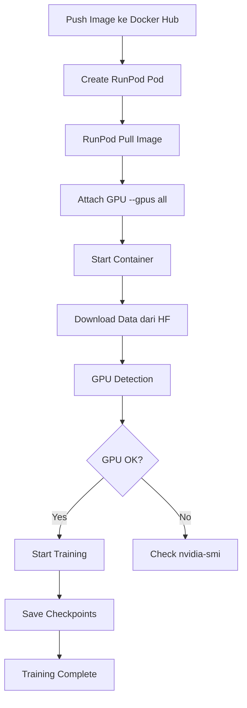

# 🚀 RunPod GPU Deployment Guide

## ⚠️ PENTING: Docker Compose vs RunPod

**Docker Compose (Local)** ≠ **RunPod (Cloud)**

RunPod **TIDAK menggunakan** docker-compose.yml! RunPod menggunakan Docker run dengan GPU flags.

---

## ✅ Cara Deploy ke RunPod dengan GPU

### Method 1: RunPod Web UI (RECOMMENDED)

1. **Push Image ke Docker Hub**
```bash
cd /home/lambda_one/tesis/GAN-HTR-ORI
docker build -t jatnikonm/gan-htr:latest -f Dockerfile .
docker push jatnikonm/gan-htr:latest
```

2. **Buat Pod di RunPod.io**
   - Login ke https://www.runpod.io
   - Click "Deploy" → "GPU Pods"
   - Select GPU: RTX 4090 / A100 (recommended)
   - Container Configuration:
     ```
     Container Image: jatnikonm/gan-htr:latest
     Docker Command: (leave empty - akan pakai entrypoint)
     ```

3. **Environment Variables**
   ```
   HF_TOKEN=hf_xxxxxxxxxxxxx
   TRAINING_SCRIPT=scripts/train32_production.sh
   MODE=production
   CUDA_VISIBLE_DEVICES=0
   TF_FORCE_GPU_ALLOW_GROWTH=true
   PYTHONUNBUFFERED=1
   HF_HUB_ENABLE_HF_TRANSFER=0
   PYTHON_BIN=/usr/bin/python3
   ```

4. **Volume Configuration**
   - Container Path: `/workspace/outputs`
   - Size: 50GB (untuk checkpoints)

5. **Port Mapping** (optional untuk monitoring)
   - 5000 → MLflow UI
   - 6006 → TensorBoard

6. **Deploy!**
   - RunPod akan otomatis:
     - Pull image
     - Attach GPU (`--gpus all`)
     - Start container dengan GPU access

---

### Method 2: RunPod CLI / API

**Install RunPod CLI:**
```bash
pip install runpod
```

**Create Pod via CLI:**
```bash
runpod create pod \
  --name "gan-htr-training" \
  --image jatnikonm/gan-htr:latest \
  --gpu-type "NVIDIA RTX 4090" \
  --gpu-count 1 \
  --volume-size 50 \
  --env HF_TOKEN=hf_xxxxx \
  --env TRAINING_SCRIPT=scripts/train32_production.sh \
  --env MODE=production \
  --env CUDA_VISIBLE_DEVICES=0 \
  --env TF_FORCE_GPU_ALLOW_GROWTH=true
```

---

### Method 3: Docker Run (Manual - jika SSH ke RunPod)

**Jika sudah SSH ke RunPod instance:**
```bash
docker run -d \
  --name gan-htr-training \
  --gpus all \
  --restart unless-stopped \
  -e HF_TOKEN=hf_xxxxx \
  -e TRAINING_SCRIPT=scripts/train32_production.sh \
  -e MODE=production \
  -e CUDA_VISIBLE_DEVICES=0 \
  -e TF_FORCE_GPU_ALLOW_GROWTH=true \
  -e PYTHONUNBUFFERED=1 \
  -e HF_HUB_ENABLE_HF_TRANSFER=0 \
  -e PYTHON_BIN=/usr/bin/python3 \
  -v /workspace/outputs:/workspace/outputs \
  -v /workspace/logbook:/workspace/logbook \
  -v /workspace/mlruns:/workspace/mlruns \
  -p 5000:5000 \
  -p 6006:6006 \
  jatnikonm/gan-htr:latest
```

**Verify GPU Detection:**
```bash
docker exec gan-htr-training python3 -c "import tensorflow as tf; print('GPU Devices:', tf.config.list_physical_devices('GPU'))"
```

Expected output:
```
GPU Devices: [PhysicalDevice(name='/physical_device:GPU:0', device_type='GPU')]
```

---

## 🔍 GPU Detection Checklist

### 1. **Di RunPod Instance (Host)**
```bash
# Check NVIDIA driver
nvidia-smi

# Expected: GPU list dengan utilization
```

### 2. **Di Container**
```bash
# Check GPU dari TensorFlow
docker exec gan-htr-training python3 -c "
import tensorflow as tf
print('TF Version:', tf.__version__)
print('GPU Devices:', tf.config.list_physical_devices('GPU'))
print('GPU Count:', len(tf.config.list_physical_devices('GPU')))
"

# Expected output:
# TF Version: 2.18.0
# GPU Devices: [PhysicalDevice(name='/physical_device:GPU:0', device_type='GPU')]
# GPU Count: 1
```

### 3. **Monitor GPU Usage During Training**
```bash
# Di host RunPod
watch -n 1 nvidia-smi

# Atau di container logs
docker logs -f gan-htr-training | grep -i gpu
```

---

## ⚠️ Troubleshooting GPU Issues

### Problem: "No GPU detected" di container

**Cause 1: Container tidak di-run dengan `--gpus all`**
```bash
# Fix: Restart container dengan GPU flag
docker stop gan-htr-training
docker rm gan-htr-training

docker run -d --gpus all \
  --name gan-htr-training \
  ... (rest of command)
```

**Cause 2: NVIDIA Container Toolkit tidak terinstall di host**
```bash
# Check di RunPod host
which nvidia-container-runtime

# Jika tidak ada, install (jarang terjadi di RunPod):
distribution=$(. /etc/os-release;echo $ID$VERSION_ID)
curl -s -L https://nvidia.github.io/nvidia-docker/gpgkey | sudo apt-key add -
curl -s -L https://nvidia.github.io/nvidia-docker/$distribution/nvidia-docker.list | \
  sudo tee /etc/apt/sources.list.d/nvidia-docker.list

sudo apt-get update
sudo apt-get install -y nvidia-container-toolkit
sudo systemctl restart docker
```

**Cause 3: CUDA version mismatch**
```bash
# Check CUDA di host
nvidia-smi | grep "CUDA Version"

# Check CUDA di container
docker exec gan-htr-training python3 -c "import tensorflow as tf; print(tf.sysconfig.get_build_info())"

# TensorFlow 2.18.0 memerlukan CUDA 12.x
# Jika host punya CUDA 11.x, pilih GPU yang compatible di RunPod
```

---

## 📊 Performance Comparison

| Environment | GPU | Epoch Time | Total (100 epochs) | Cost |
|-------------|-----|------------|-------------------|------|
| **Local (CPU)** | None | 45 min | 75 hours | $0 (slow) |
| **RunPod RTX 4090** | 1x | 3 min | 5 hours | ~$1.50 |
| **RunPod A100 (80GB)** | 1x | 1.5 min | 2.5 hours | ~$2.50 |

**Recommendation:** RTX 4090 untuk cost-performance terbaik

---

## 🎯 Verification Steps Post-Deploy

### 1. Check Container Status
```bash
docker ps | grep gan-htr-training
```

### 2. Check GPU Detection
```bash
docker logs gan-htr-training | head -50 | grep -i gpu
```

Expected:
```
✅ GPU: 1 device(s)
```

NOT:
```
⚠️ CPU mode
```

### 3. Monitor Training Progress
```bash
docker logs -f gan-htr-training | grep "Epoch"
```

### 4. Check GPU Utilization
```bash
# Di RunPod host
nvidia-smi

# Expected: GPU Utilization: 95-100%
#          Memory Usage: ~15-20GB / 24GB (RTX 4090)
```

### 5. Verify Output Files
```bash
docker exec gan-htr-training ls -lh /workspace/outputs/checkpoints_fp32_production/
docker exec gan-htr-training ls -lh /workspace/outputs/samples_fp32_production/
```

---

## 🚨 CRITICAL: RunPod-Specific Settings

### Auto-Restart on Preemption (Spot Instances)
```bash
# Add to docker run command:
--restart unless-stopped
```

### Persistent Storage
```bash
# RunPod persistent volume path
-v /workspace/outputs:/workspace/outputs
-v /workspace/checkpoints:/workspace/checkpoints

# Jangan simpan ke /tmp atau ephemeral storage!
```

### Cost Optimization
```bash
# Gunakan Spot Instances (70% lebih murah)
# RunPod UI: Select "Spot" bukan "On-Demand"

# Set max price per hour
# Recommended: $0.50/hr untuk RTX 4090 Spot
```

---

## ✅ Expected Workflow di RunPod



---

## 📝 Summary

**Key Points:**
1. ✅ RunPod otomatis attach GPU dengan `--gpus all`
2. ✅ Tidak perlu `docker-compose.yml` di RunPod
3. ✅ TensorFlow base image sudah support CUDA
4. ✅ Dockerfile sudah correct (FROM tensorflow/tensorflow:2.18.0-gpu)
5. ⚠️ Verify GPU detection setelah container start
6. ⚠️ Use persistent volume untuk outputs
7. ⚠️ Monitor GPU utilization dengan nvidia-smi

**Container sudah READY untuk RunPod dengan GPU!** 🎉
